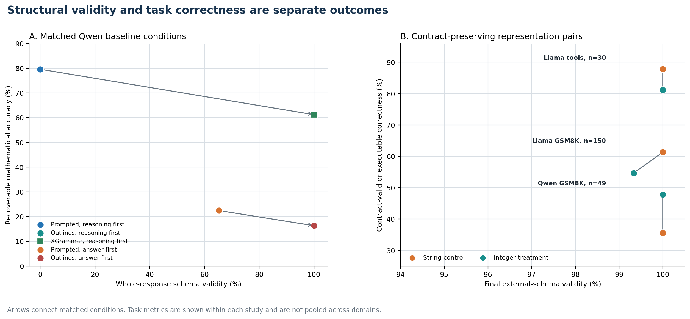
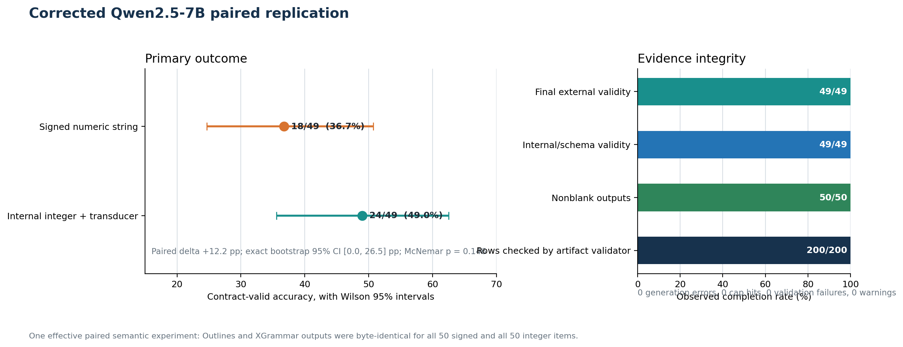
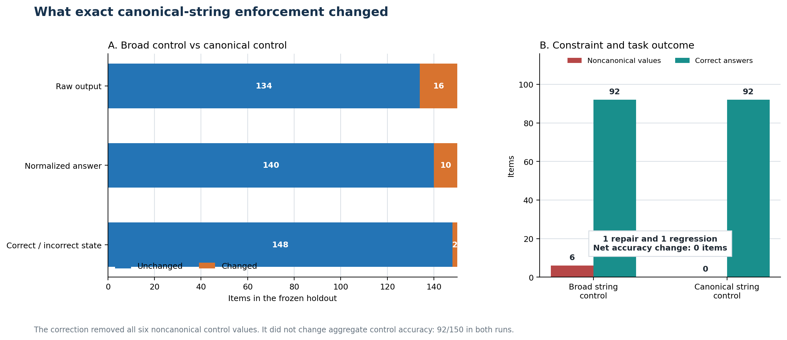
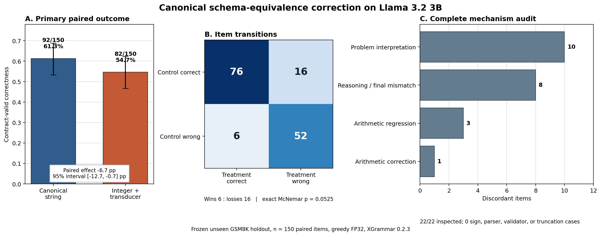
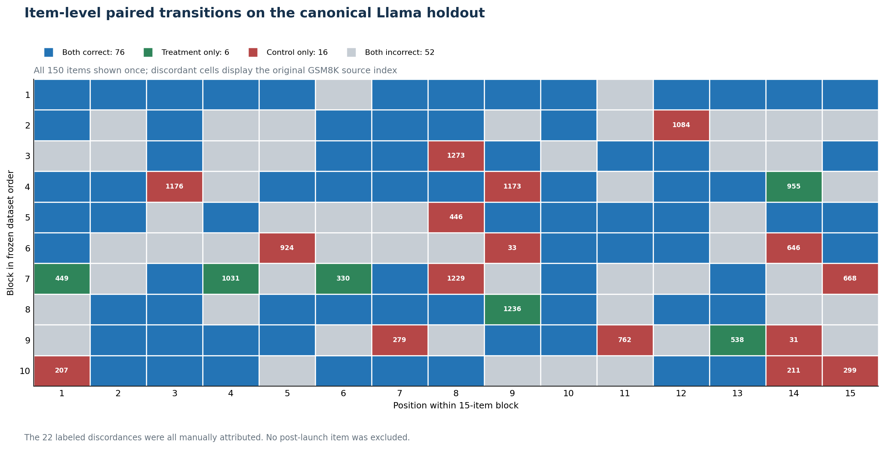
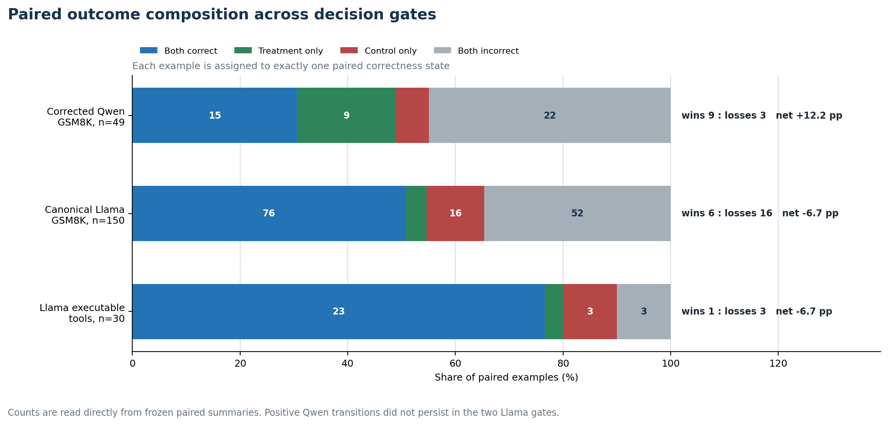
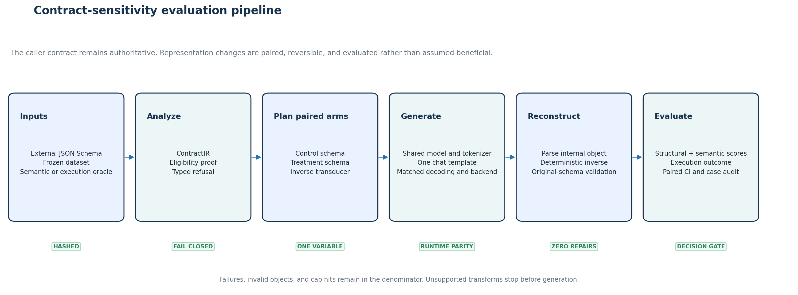

<div align="center">

# Constrained Sensitivity Lab

### Measuring how structured-output contracts change LLM behavior

An artifact-backed research and evaluation system for separating structural
validity, semantic correctness, and executable success under constrained decoding.

[](https://github.com/Vaibhav701161/constrained-senstivity-lab/actions/workflows/ci.yml)
[](https://vaibhav701161.github.io/constrained-senstivity-lab/)
[](https://www.python.org/)
[](experiments/replay-validation.json)
[](LICENSE)

[**Documentation**](https://vaibhav701161.github.io/constrained-senstivity-lab/) ·
[Results](#the-result-in-30-seconds) ·
[Evidence](#accepted-evidence-chain) ·
[StructTrace](#from-research-to-structtrace) ·
[Architecture](#system-architecture) ·
[Reproduce](#reproduce-the-evidence) ·
[Publications](#technical-publications)

</div>

---

## The problem

Structured-output systems are usually judged by a simple question: did the model
return valid JSON?

That question is necessary, but incomplete. A grammar can make every response
schema-valid while changing which answers the model gets right. A schema rewrite
can preserve the caller-facing contract while changing the model's reasoning,
interpretation, or final answer.

Constrained Sensitivity Lab measures those changes directly. It is a research
record, an evaluation harness, and a narrow fail-closed contract analysis
prototype. It is not a claim that one schema representation is always better.

It treats the model-facing contract as an experimental variable and separately
scores:

- semantic correctness before contract requirements;
- internal-schema validity;
- reconstructed external-schema validity;
- contract-valid correctness;
- exact tool arguments and execution success;
- paired repairs and regressions;
- token counts, cap hits, errors, and descriptive latency;
- reasoning and final-answer consistency.

> **Core finding:** a compiler can prove that a representation rewrite preserves
> an external contract. It cannot assume that the rewrite preserves or improves
> model quality.

## The result in 30 seconds

We tested one narrow, contract-preserving rewrite: let the model emit a JSON integer
instead of a canonical signed numeric string, then deterministically stringify the
integer and validate the original caller-facing schema.

The rewrite looked useful on Qwen2.5 7B. It reversed direction on a different model
family and a repository-unseen holdout. An exact schema correction did not rescue
the result. A bounded executable tool-call pilot also found no practical benefit.

| Accepted decision gate | String control | Integer treatment | Paired effect | Wins : losses | Interpretation |
|---|---:|---:|---:|---:|---|
| Corrected Qwen2.5 7B, GSM8K, n=49 | 18/49 (36.7%) | 24/49 (49.0%) | +12.2 pp, CI [0.0, 26.5] | 9 : 3 | Scoped positive estimate |
| Canonical Llama 3.2 3B, GSM8K, n=150 | 92/150 (61.3%) | 82/150 (54.7%) | -6.7 pp, CI [-12.7, -0.7] | 6 : 16 | Cross-family failure |
| Llama 3.2 3B, executable tools, n=30 | 26/30 (86.7%) | 24/30 (80.0%) | -6.7 pp, CI [-20.0, 6.7] | 1 : 3 | No practical benefit detected |


The point estimates are intentionally not pooled. The models, tasks, and outcome
definitions differ. Each interval and transition count belongs to its own frozen
paired study.

### Decision

The project continues as a **contract-sensitivity evaluation harness**, supported
by conservative contract analysis and deterministic transduction utilities.

The completed evidence closes this general claim:

> Replacing a model-facing canonical signed numeric string with a JSON integer is a
> generally useful model-quality optimization.

The deterministic transformation remains safe inside its proven domain. What did
not generalize was its effect on model quality. Negative replication evidence is
the reason the architecture now measures regressions instead of silently applying
the rewrite.

[Read the full decision chain](https://vaibhav701161.github.io/constrained-senstivity-lab/studies/evidence-overview/) ·
[Open the results dashboard](https://vaibhav701161.github.io/constrained-senstivity-lab/results/)

## From research to StructTrace

The product implementation of this conclusion is
[StructTrace](https://github.com/Vaibhav701161/structtrace), a local-first paired regression system
for structured extraction outputs. It did not begin from a generic dashboard template. Its core
requirements follow from this repository's accepted evidence:

| Research conclusion | StructTrace capability |
|---|---|
| Valid JSON can still be semantically wrong | Separate parsing, schema, semantic, executable, and deployment outcomes |
| Contract representation can change paired answers | Matched baseline/candidate cases with repair and regression transitions |
| The Qwen gain reversed on canonical Llama | No universal schema optimizer or automatic rewrite claim |
| Evidence and evaluator failures must stay visible | Complete denominators, fail-closed evaluator errors, and multi-state gates |
| One study is not a deployment decision | Workload-specific release thresholds, immutable artifacts, and replay |
| Regressions recur across iterations | Accepted baselines, pinned critical cases, and project-bound CI export |

The repositories have deliberately different authority. This lab owns frozen model experiments,
raw generations, protocol corrections, paired statistics, and mechanism audits. StructTrace owns
the reusable Rust engine and local product workflow. Its
[`research-foundation.json`](https://github.com/Vaibhav701161/structtrace/blob/main/provenance/research-foundation.json)
pins this repository's source revision and hashes of the three accepted summaries. The
`structtrace demo research` command reproduces their transition matrices as normalized offline
fixtures; it does not claim to replay the original GPU generations.

[Read the complete research-to-product bridge](docs/system/structtrace-productization.md) ·
[Open StructTrace](https://github.com/Vaibhav701161/structtrace)

## Measurement model

The harness keeps four outcomes separate:

| Layer | Question | Example failure |
|---|---|---|
| Parsing | Is the response a complete JSON value? | Extra prose or truncated object |
| Schema validity | Does the object satisfy the model-facing and final external schemas? | Number emitted where a string is required |
| Semantic correctness | Are the task answer and exact fields correct? | Valid JSON containing the wrong answer |
| Executable correctness | Does the validated call produce the correct state transition? | Valid arguments with the wrong quantity |

An output can pass every structural check and still be wrong. The experiments never
collapse these layers into a single quality score.



This distinction is the central engineering lesson. Constrained decoding is a
reliable syntax mechanism. It is not, by itself, a semantic quality guarantee.

---

## Accepted evidence chain

Every stage below records the hypothesis, frozen inputs, raw rows, artifact
validation, paired analysis, and decision that authorized or stopped the next
stage. Historical positive signals remain visible, but later evidence controls the
current conclusion.

### 1. Baseline: validity improved while semantic accuracy fell

The primary baseline compared six matched conditions on a deterministic GSM8K
subset using `Qwen/Qwen2.5-7B-Instruct`, greedy decoding, FP32, and a 256-token cap.
One contradictory reference item was retained in the raw record and excluded only
from the predeclared clean analysis.

| Qwen2.5 7B condition | Recoverable accuracy | Strict accuracy | Schema compliance |
|---|---:|---:|---:|
| Free response | 36/49 (73.5%) | Not applicable | Not applicable |
| Prompted JSON, reasoning first | 39/49 (79.6%) | 0/49 (0.0%) | 0.0% |
| Outlines, reasoning first | 30/49 (61.2%) | 30/49 (61.2%) | 100.0% |
| XGrammar, reasoning first | 30/49 (61.2%) | 30/49 (61.2%) | 100.0% |
| Prompted JSON, answer first | 11/49 (22.4%) | 8/49 (16.3%) | 65.3% |
| Outlines, answer first | 8/49 (16.3%) | 8/49 (16.3%) | 100.0% |


The reasoning-first constrained conditions reached 100% compliance and lost nine
paired mathematical answers against prompt-only JSON, with no gains. The prompt-only
outputs were valid JSON but used unquoted numbers where the schema required strings,
which is why recoverable and strict accuracy are reported separately.

**Primary record:** [baseline study](docs/studies/qwen-baseline.md) ·
[frozen combined summary](results/qwen2.5-7b/primary/combined/summary_clean.json) ·
[per-item evidence](results/qwen2.5-7b/primary/combined/items.md)

### 2. Field order behaved like a causal variable

Changing only the required JSON field order produced a larger effect than switching
between Outlines and XGrammar.

| System | Reasoning-first recoverable | Answer-first recoverable | Paired change | Schema compliance |
|---|---:|---:|---:|---:|
| Prompt-only JSON | 79.6% | 22.4% | -57.1 pp | 0.0% to 65.3% |
| Outlines JSON | 61.2% | 16.3% | -44.9 pp | 100.0% to 100.0% |


Under Outlines, compliance stayed fixed at 100%. The 44.9-point decline therefore
cannot be explained by malformed JSON. Generation order itself changed model
behavior in this setup.

The paired analysis found 23 reasoning-first-only wins and one answer-first-only
win under Outlines. Exact McNemar `p = 0.00000298`. This is evidence for sensitivity
to generation order in this particular model, prompt, dataset, and schema. It is
not a universal field-order law.


### 3. A narrow contract-preserving transform looked promising on Qwen

The baseline localized one possible sensitivity boundary: a signed numeric string.
The prototype allowed the model to emit a native JSON integer, deterministically
converted that integer to canonical base-10 text, rebuilt the external object, and
validated it against the original schema.


The first historical alignment gate estimated a +14.3 point recovery for both
backends. A later audit found runner-divergence risks, so the result was not accepted
as the final evidence.

The corrected shared-path replication produced:

| Corrected Qwen representation | Contract-valid correct | External validity |
|---|---:|---:|
| Signed numeric string | 18/49 (36.7%) | 49/49 (100.0%) |
| Integer plus deterministic stringification | 24/49 (49.0%) | 49/49 (100.0%) |



The +12.2 point estimate cleared the frozen continuation threshold, but its interval
touched zero and exact McNemar `p = 0.145996`. This authorized an independent model
family and unseen holdout. It did not authorize a general optimization claim.

The corrected study also found byte-identical outputs between Outlines and XGrammar
for every item in both representations. Backend parity in this narrow run reduced
implementation-divergence risk, but it did not create an independent semantic
replication.

**Primary record:** [frozen protocol](experiments/corrected-replication/protocol.md) ·
[artifact validation](experiments/corrected-replication/results/qwen2.5-7b-corrected/artifact-validation.json) ·
[exact paired summary](experiments/corrected-replication/results/qwen2.5-7b-corrected/paired-summary-exact.md) ·
[decision report](experiments/corrected-replication/results/qwen2.5-7b-corrected/decision-report.md)

### 4. The improvement reversed on Llama and unseen items

The confirmatory replication changed the model family to
`meta-llama/Llama-3.2-3B-Instruct` and selected 150 previously unseen GSM8K test
items after scanning repository artifacts for prior exposure.

The runner froze:

- one model and tokenizer revision;
- XGrammar 0.2.3;
- greedy decoding, seed 0, FP32, and 256 maximum new tokens;
- identical chat-template and generation paths;
- one dataset order and hash;
- no post-launch exclusions;
- errors and cap hits as failures in the denominator.

The initial broad-string control scored 92/150 while the integer treatment scored
82/150. An external review then found that the string schema accepted decimals,
fractions, comma grouping, and leading zeros, while the compiler proved equivalence
only for canonical signed integers.

That mismatch was real. It required correction before a final claim.

This broad-string run is retained as a disclosed intermediate result, not the
accepted final replication. The corrected canonical control below carries the
decision.

### 5. Exact schema equivalence did not rescue the result

The correction preregistered exactly one new 150-row canonical string control:

```regex
^-?(?:0|[1-9][0-9]*)$
```

It reused the same model revision, dataset, prompt, backend, decoding environment,
analysis rule, and immutable integer treatment. No new treatment output was
generated.



The stricter grammar removed all six noncanonical control outputs. Across the 150
items, 134 raw outputs and 140 normalized answers remained identical. There was one
accuracy repair and one regression, leaving control accuracy unchanged at 92/150.



The corrected outcome remained 92/150 versus 82/150, a **-6.7 point effect** with
paired interval **[-12.7, -0.7]**. There were six treatment-only wins and sixteen
control-only losses. The integer treatment retained one token-cap failure, so final
external validity was 149/150 rather than 100%. The row remained in the denominator.

Every discordant item was manually inspected:

| Attribution category | Count |
|---|---:|
| Problem-interpretation change | 10 |
| Reasoning and final-answer inconsistency | 8 |
| Arithmetic regression | 3 |
| Arithmetic correction | 1 |
| Sign or lexical-boundary change | 0 |
| Parser, validator, transducer, or truncation issue | 0 |

The schema mismatch did not explain away the negative direction. The final decision
closed the default optimizer thesis.



**Primary record:** [preregistered correction](experiments/canonical-schema-equivalence-correction/protocol.md) ·
[mismatch audit](experiments/canonical-schema-equivalence-correction/mismatch-audit.json) ·
[150-row artifact validation](experiments/canonical-schema-equivalence-correction/artifact-validation.json) ·
[complete discordance audit](experiments/canonical-schema-equivalence-correction/failure-attribution.jsonl) ·
[decision report](experiments/canonical-schema-equivalence-correction/decision-report.md)

### 6. A bounded executable pilot also found no benefit

The Red replication path authorized one practical pilot based on pinned BFCL V4
`simple_python` cases. It used deterministic local wrappers with no external side
effects and scored the complete chain from tool selection through post-execution
state.


Both arms reached 100% internal validity, reconstructed external validity, and
execution acceptance. The semantic result was still negative: 26/30 successful
control calls versus 24/30 treatment calls. The failures came from argument
semantics, not from parsing, validation, or transduction.

The interval crossed zero, so this does not prove that the treatment harms tool
execution. It does show that the tested rewrite produced no detected benefit under
the predeclared practical gate.

**Primary record:** [pinned BFCL foundation](experiments/tool-call-gate/FOUNDATION.md) ·
[protocol](experiments/tool-call-gate/protocol.md) ·
[artifact validation](experiments/tool-call-gate/artifact-validation.json) ·
[paired summary](experiments/tool-call-gate/paired-summary.md) ·
[decision report](experiments/tool-call-gate/decision-report.md)

### The paired case balance

Marginal accuracy alone hides which examples changed. The transition ledger shows
whether a treatment repaired an item, broke an item, left both correct, or left both
wrong.



The Qwen run had six more repairs than regressions. The canonical Llama run had ten
more regressions than repairs. The executable pilot had two more regressions than
repairs. This case-level asymmetry is what drives each paired point estimate.

---

## System architecture



The system has two distinct responsibilities. The contract path decides whether a
rewrite is representationally safe. The evaluation path determines whether the
model behaves better, worse, or differently under that rewrite. Passing the first
path never substitutes for evidence from the second.

```text
External JSON Schema
        ↓
ContractIR
        ↓
Alignment analysis
        ↓
AlignmentPlan or typed refusal
        ↓
Internal JSON Schema
        ↓
XGrammar / Outlines
        ↓
Internal object
        ↓
Deterministic inverse transducer
        ↓
Original external-schema validation
        ↓
Caller-facing object
        ↓
Paired semantic and execution analysis
```

The shared runtime keeps model loading, tokenizer handling, chat-template
application, generation, visible-token counting, latency measurement, error
handling, manifests, and artifact writing identical between paired representations.

Only three elements may differ:

1. the model-facing schema;
2. the symbolic representation described in the prompt;
3. whether deterministic inverse transduction is required.

### Implemented surfaces

| Surface | Responsibility |
|---|---|
| `ContractIR` | Canonical internal representation of the supported external schema |
| Alignment analysis | Detect eligible boundaries and reject unsafe rewrites |
| `AlignmentPlan` | Serializable transformation and inverse-transduction plan |
| Shared runtime | Enforce generation parity across experimental arms |
| Inverse transducer | Reconstruct the caller-facing representation without heuristics |
| Final validator | Revalidate against the original, unchanged external schema |
| Paired analyzer | Compute transitions, intervals, exact tests, and mechanism audits |
| Artifact replay | Recompute the second-family and tool-call scores without model weights or cloud compute |

### Supported and refused contracts

Supported or evidence-backed:

- canonical signed integer strings;
- JSON integer to canonical-string transduction;
- strict original-contract revalidation;
- deterministic, serializable alignment plans;
- field ordering and key aliases as explicitly scoped prototypes;
- matched paired evaluation and artifact replay.

Refused by design:

- `$ref` resolution;
- unions and ambiguous schema branches;
- arbitrary regular-expression transformation;
- rewrites that drop bounds, enumerations, constants, or `multipleOf`;
- heuristic repairs, rounding, or silent coercion in scored paths.

[Inspect the architecture](https://vaibhav701161.github.io/constrained-senstivity-lab/architecture/) ·
[Open the support matrix](https://vaibhav701161.github.io/constrained-senstivity-lab/supported-contracts/)

## What is usable today

This repository is a research-grade harness rather than a hosted product. The
following surfaces are implemented and tested:

- parse a bounded subset of JSON Schema into a canonical `ContractIR`;
- produce a serializable `AlignmentPlan` for supported transforms;
- refuse unsupported or lossy transforms with typed errors;
- compile paired internal schemas for signed-string and integer representations;
- run matched Outlines or XGrammar generation through one shared runtime;
- deterministically reconstruct and validate the unchanged external contract;
- score semantic correctness, schema validity, exact tool arguments, execution,
  cap hits, errors, tokens, and descriptive latency separately;
- resume interrupted generation without duplicating completed rows;
- compute paired transitions, exact McNemar tests, and deterministic bootstrap
  intervals;
- replay 398 second-family rows and 66 tool-call rows from raw output artifacts;
- verify separate corrected-Qwen and canonical-correction artifacts with dedicated
  validators.

The public API is not yet promised stable. New integrations can import the branded
`constrained_sensitivity_lab` facade. The historical implementation namespace
`project_a` remains because frozen source manifests and archived run packages refer
to it by path.

### Contract support policy

| Feature | Status | Evidence or boundary |
|---|---|---|
| Canonical signed integer string | Supported | Property tests and paired studies |
| Integer to canonical string transduction | Supported | 1,501 deterministic property cases |
| Original external-schema revalidation | Supported | Required in every treatment path |
| Field ordering | Measured sensitivity | Strong Qwen evidence, not an automatic rewrite |
| Key aliases | Prototype | Unit tested, not empirically validated at scale |
| Scratch reasoning field | Experimental | Safety tested, quality benefit not established |
| `$ref` and recursive schemas | Refused | No sound resolver in the current prototype |
| Ambiguous unions | Refused | No proof of a unique inverse representation |
| Arbitrary regex transforms | Refused | Unsafe without an explicit equivalence proof |
| Heuristic repair | Excluded | Never allowed in scored paths |

Refused entries are not missing marketing checkboxes. They are deliberate
boundaries that keep the current evidence interpretable.

## Research integrity controls

- Datasets are selected before generation and bound by hashes.
- Previously seen item IDs are removed before unseen-set sampling.
- Operational canaries do not inspect early semantic wins.
- Completed rows are persisted individually and resume safely after interruption.
- Model revisions, tokenizer revisions, packages, prompts, and run signatures are
  frozen in manifests.
- Generation errors, invalid objects, and token-cap hits remain in denominators.
- No confirmatory output is removed after viewing model behavior.
- Every confirmatory discordance is retained and manually categorized.
- Negative results, runner defects, and corrected interpretations remain public.
- New prompts or model families require a new protocol, not a rescue search.

### Artifact and replay coverage

The validators have different scopes. The counts below are not summed into an
inflated total because some studies reuse immutable rows from earlier gates.

| Evidence set | Generated rows checked | Validation route | Result |
|---|---:|---|---|
| Corrected Qwen, four backend-representation conditions | 200/200 | Frozen artifact validator | 0 failures, 0 warnings |
| Broad second-family matrix, fresh plus bridge | 398/398 | Artifact validator and raw-output score replay | 0 row or paired-summary mismatches |
| Canonical schema correction, new control only | 150/150 | Dedicated validator with score replay | 0 score mismatches |
| Executable tool-call pilot, primary plus stress | 66/66 | Artifact validator and raw-output score replay | 0 row or paired-summary mismatches |

The one-command `464`-row replay is specifically `398` broad second-family rows plus
`66` tool-call rows. Corrected Qwen and canonical correction use their own validators
and are reported separately.

### Claims we make

- Structured validity and semantic correctness are different measurements.
- In the Qwen baseline, field order materially changed recoverable accuracy while
  constrained schema compliance remained 100%.
- The integer representation had a positive but uncertain estimate on corrected
  Qwen and a negative estimate on canonical Llama.
- The Qwen improvement did not replicate across the tested model family and unseen
  holdout.
- The bounded executable pilot detected no benefit from the same transform.
- The supported integer-to-string transducer preserves the external contract within
  its explicitly tested canonical domain.

### Claims we do not make

- Constrained decoding generally reduces reasoning quality.
- JSON integers are generally worse than numeric strings.
- The executable pilot proves a harmful effect; its interval crosses zero.
- Outlines and XGrammar are always behaviorally identical.
- The current experiments cover every model, task, prompt, schema, or provider.
- A safe compiler transform is automatically a useful model optimization.

### Known limitations

- GSM8K is a narrow mathematical reasoning benchmark.
- The confirmatory model-family evidence covers Qwen2.5 and Llama 3.2, not the full
  model landscape.
- Greedy decoding isolates deterministic paired changes but does not characterize
  sampling variance.
- The practical tool-call gate is intentionally small and single-turn.
- Manual discordance categories are audited engineering judgments, not automated
  causal proof.
- Latency is descriptive because runs used different hardware and environments.
- The schema compiler supports a narrow subset and refuses ambiguous constructs.

These limitations constrain the claim. They do not invalidate the measured paired
transitions inside the frozen protocols.

## Reproduce the evidence

The lightweight audit path requires Python 3.11 or 3.12. It does not require a GPU,
model download, Outlines, or XGrammar.

```bash
git clone https://github.com/Vaibhav701161/constrained-senstivity-lab.git
cd constrained-senstivity-lab
python -m venv .venv
source .venv/bin/activate
python -m pip install -e ".[dev]"

python -m pytest
python scripts/replay_artifacts.py \
  --scope all \
  --out /tmp/replay-validation.json
```

Current general replay result:

```text
464 rows replayed
0 row-score mismatches
0 paired-summary mismatches
```

The replay recomputes the broad second-family and tool-call row scores and paired
summaries from checked-in JSONL. It does not trust the published Markdown reports as
input evidence. The corrected-Qwen and canonical-correction validators are separate,
as shown in the coverage table above.

Regenerate every overview figure from checked-in machine-readable evidence:

```bash
python scripts/build_figures.py
python scripts/build_corrected_replication_figures.py
python scripts/build_replication_gate_figures.py
python scripts/build_evidence_dashboard_figures.py
```

Each generator writes publication-ready SVG and browser-ready PNG output. The
figures contain no stock illustration and no manually edited result values.

Install generation dependencies only when performing new model inference:

```bash
python -m pip install \
  -r requirements-generation.txt \
  -r requirements-backends.txt \
  -r requirements-analysis.txt
python scripts/probe_environment.py
```

[Open the complete reproducibility guide](https://vaibhav701161.github.io/constrained-senstivity-lab/reproducibility/artifact-replay/)

## Documentation

The documentation site is the primary long-form reading surface. It provides
searchable, structured navigation without forcing the README to contain every
protocol and artifact link.

| Section | Purpose |
|---|---|
| [Start](https://vaibhav701161.github.io/constrained-senstivity-lab/getting-started/overview/) | Concepts, orientation, and the GPU-free quickstart |
| [Findings](https://vaibhav701161.github.io/constrained-senstivity-lab/results/) | Final effects, validity gaps, transitions, item maps, and artifact scope |
| [Studies](https://vaibhav701161.github.io/constrained-senstivity-lab/studies/evidence-overview/) | Chronological baseline, replication, correction, and executable gates |
| [System](https://vaibhav701161.github.io/constrained-senstivity-lab/system/) | Contract analysis, runtime parity, transduction, and support policy |
| [Methods](https://vaibhav701161.github.io/constrained-senstivity-lab/methods/) | Denominators, paired statistics, correction policy, and metric definitions |
| [Reproduce](https://vaibhav701161.github.io/constrained-senstivity-lab/reproducibility/) | Tests, artifact replay, figure regeneration, environments, and evidence map |
| [Evidence map](https://vaibhav701161.github.io/constrained-senstivity-lab/reproducibility/evidence-map/) | Protocols, manifests, raw rows, audits, and reports |
| [Archive](https://vaibhav701161.github.io/constrained-senstivity-lab/archive/) | Frozen historical reports and operational ledgers with lifecycle labels |
| [Publications](https://vaibhav701161.github.io/constrained-senstivity-lab/publications/) | Eight-part public technical series |

Build the site locally:

```bash
python -m pip install -r requirements-docs.txt
mkdocs serve
```

## Repository map

```text
constrained-senstivity-lab/
|-- assets/                 # deterministic data-derived technical figures
|-- articles/               # retained sources for public technical reports
|-- data/                   # frozen datasets and integrity manifests
|-- deployment/             # exact Kaggle and Modal execution surfaces
|-- docs/                   # documentation site and research records
|-- experiments/            # protocols, raw rows, audits, and decisions
|-- scripts/                # preparation, execution, analysis, and replay
|-- src/constrained_sensitivity_lab/ # branded public import facade
|-- src/project_a/          # frozen-compatible implementation and contract logic
`-- tests/                  # unit, property, parity, and artifact tests
```

## Technical publications

The public series records how the question changed as evidence and implementation
audits accumulated:

1. [Grammars are written in characters. Models emit tokens.](https://dev.to/vaibhav_mittal_ac22a2c5d6/grammars-are-written-in-characters-models-emit-tokens-1k07)
2. [I Expected JSON Grammar Masks to Kill Sampling Diversity. The Prompt Got There First.](https://dev.to/vaibhav_mittal_ac22a2c5d6/i-expected-json-grammar-masks-to-kill-sampling-diversity-the-prompt-got-there-first-55fj)
3. [Why Return Valid JSON Is Not a Decoding Constraint](https://dev.to/vaibhav_mittal_ac22a2c5d6/why-return-valid-json-is-not-a-decoding-constraint-2bl8)
4. [Structured Output Fixed My JSON and Cut Math Accuracy by 18 Points](https://dev.to/vaibhav_mittal_ac22a2c5d6/structured-output-fixed-my-json-and-cut-math-accuracy-by-18-points-jm5)
5. [Constraints Cost 18 Points. Compiling the Schema Recovered 14.](https://dev.to/vaibhav_mittal_ac22a2c5d6/constraints-cost-18-points-compiling-the-schema-recovered-14-1f72)
6. [I Found a Runner Bug, Re-ran 200 Generations, and the Effect Survived](https://dev.to/vaibhav_mittal_ac22a2c5d6/i-found-a-runner-bug-re-ran-200-generations-and-the-effect-survived-o5c)
7. [The Optimization Worked on Qwen. It Failed on Llama and Tool Calls.](https://dev.to/vaibhav_mittal_ac22a2c5d6/the-optimization-worked-on-qwen-it-failed-on-llama-and-tool-calls-40oe)
8. [I Fixed a Schema Mismatch. The Negative Result Survived.](https://dev.to/vaibhav_mittal_ac22a2c5d6/i-fixed-a-schema-mismatch-the-negative-result-survived-192l)

[Browse all eight articles](https://vaibhav701161.github.io/constrained-senstivity-lab/publications/)

## Citation

If this work informs research or engineering, cite the exact archived revision used.
Repository metadata is available in [CITATION.cff](CITATION.cff).

```bibtex
@software{mittal_constrained_sensitivity_lab,
  author  = {Vaibhav Mittal},
  title   = {Constrained Sensitivity Lab},
  year    = {2026},
  url     = {https://github.com/Vaibhav701161/constrained-senstivity-lab}
}
```

Released under the [MIT License](LICENSE).
