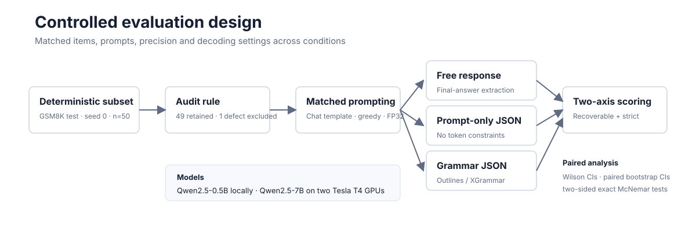

# Constrained Decoding Under Matched Conditions

A controlled, artifact-validated study of how JSON prompting, grammar-constrained
decoding, and output-field order affect mathematical accuracy and schema compliance.

[Results](#principal-results) | [Study design](#study-design) |
[Reproduction](#reproduce-the-evaluation) | [Evidence](#evidence-map) |
[Limitations](#scope-and-limitations)

## Central result

Constrained decoding solved the formatting problem, but it did not preserve all of
the model's recoverable mathematical accuracy. On Qwen2.5-7B, prompt-only JSON
achieved 79.6% recoverable accuracy and 0% schema compliance. Outlines and XGrammar
each achieved 61.2% recoverable accuracy and 100% schema compliance. The paired
semantic effect was -18.4 percentage points for both backends (exact McNemar
`p = 0.003906`).

This is not a claim that constrained decoding is universally harmful. It is a
controlled reproduction showing that contract compliance and semantic correctness
are separate outcomes, and that a decoder can improve the first while reducing the
second under a specific, matched setup.


## Principal results

The primary 7B matrix contains 300 validated generations across six conditions. The
clean analysis retains 49 paired items per condition after applying one predeclared
dataset-quality exclusion.

| Qwen2.5-7B condition | Recoverable accuracy | Strict accuracy | Schema compliance |
|---|---:|---:|---:|
| Free response | 36/49 (73.5%) | n/a | n/a |
| Prompted JSON, reasoning first | 39/49 (79.6%) | 0/49 (0.0%) | 0.0% |
| Outlines, reasoning first | 30/49 (61.2%) | 30/49 (61.2%) | 100% |
| XGrammar, reasoning first | 30/49 (61.2%) | 30/49 (61.2%) | 100% |
| Prompted JSON, answer first | 11/49 (22.4%) | 8/49 (16.3%) | 65.3% |
| Outlines, answer first | 8/49 (16.3%) | 8/49 (16.3%) | 100% |

Two scoring views are reported deliberately:

- **Recoverable accuracy** asks whether the intended numeric value can be extracted,
  even if the response violates the schema.
- **Strict accuracy** requires a correct value inside a schema-compliant answer
  field. It measures immediately usable output under the declared contract.

The frozen primary outcome was strict accuracy. Under that outcome, constraints
improved usable correctness because the prompt-only model emitted every answer as an
unquoted JSON number instead of the required numeric string. The recoverable view
isolates semantic correctness and reveals the constraint-associated loss.


### Findings supported by the completed matrix

1. **Valid JSON is not equivalent to schema compliance.** The 7B prompt-only,
   reasoning-first condition produced 100% valid JSON and 0% schema-valid output.
2. **Grammar constraints act on semantics as well as syntax.** Outlines and XGrammar
   each lost 9 paired wins and gained none against the matched prompt-only condition.
3. **Field order was more influential than backend choice.** Moving the answer before
   the reasoning reduced recoverable accuracy by 57.1 points under prompting and
   strict accuracy by 44.9 points under Outlines.
4. **Aggregate ties do not imply identical behavior.** Outlines and XGrammar tied at
   30/49, but each uniquely solved one item; only 20/49 raw responses were
   byte-identical.
5. **The observed effect depends on model scale.** The matched 0.5B comparison did not
   detect a semantic constraint cost at this sample size and low base accuracy.
6. **Numerical precision was an experimental validity issue.** On the tested T4
   environment, 4-bit and FP16 paths corrupted tokens, while BF16 preserved structure
   but damaged digits. FP32 was required before the 7B outputs were accepted as task
   evidence.

The full statistical interpretation, prompt-development history, failure analysis,
and relationship to prior work are documented in the
[research report](docs/research-report.md).

## Study design



The comparison holds the dataset items, JSON prompt text, chat template, model,
precision, greedy decoding, token budget, and scoring code constant wherever a paired
contrast requires them to be constant.

| Component | Specification |
|---|---|
| Dataset | Deterministic 50-item sample from `openai/gsm8k` test, seed 0 |
| Dataset hash | `3639f2f6def0f50e02086bc91e6f4a45567c85aa9b0f498224cb9421400d812a` |
| Data audit | One contradictory reference row retained in raw scores and excluded from the predeclared clean analysis |
| Models | Qwen2.5-0.5B-Instruct and Qwen2.5-7B-Instruct |
| Decoding | Greedy, seed 0, maximum 256 generated tokens |
| Prompt formatting | `tokenizer.apply_chat_template(..., add_generation_prompt=True)` |
| Constraint backends | Outlines 1.3.2 and XGrammar 0.2.3 |
| Primary precision | FP32 |
| Uncertainty | Wilson group intervals and paired-bootstrap effect intervals |
| Paired tests | Two-sided exact McNemar tests over discordant items |
| Failure policy | Generation errors and token-cap hits remain in denominators |

Every raw result row records the source item, formatted prompt, raw output, parsed
fields, validity flags, strict and recoverable scores, latency, token counts, model
configuration, and run signature. The two accepted 7B runs were independently checked
for source hashes, planned item order, row counts, prompt version, precision, decoding
configuration, duplicates, errors, and cap hits.

## Repository structure

```text
constrained-decoding-lab/
|-- assets/figures/                 # deterministic, data-derived SVG figures
|-- data/                           # fixed evaluation subset and audit policy
|-- deployment/kaggle/
|   |-- kernel/                     # Kaggle entry point and metadata
|   `-- source-snapshot/            # exact source used by accepted cloud runs
|-- docs/
|   |-- methodology.md              # frozen analysis protocol
|   |-- research-report.md          # complete interpretation and limitations
|   |-- run-ledgers/                # version-by-version local and cloud evidence
|   `-- archive/                    # foundational probes and pilot record
|-- results/
|   |-- diagnostics/                # failed and precision-diagnostic evidence
|   |-- pilots/                     # early local evaluation evidence
|   |-- qwen2.5-0.5b/primary/       # accepted local matrix
|   `-- qwen2.5-7b/primary/         # accepted cloud matrix and combined analysis
|-- scripts/                        # preparation, evaluation, analysis, validation
`-- tests/                          # scoring and summarization regression tests
```

The visible taxonomy is based on scientific role rather than calendar labels.
Historical prompt IDs and the external Kaggle dataset slug are preserved exactly
inside provenance records because changing them would rewrite the identity of runs
that already occurred.

## Reproduce the evaluation

### 1. Create the verified local environment

```bash
uv venv .venv --python 3.12
uv pip install --python .venv/bin/python -r requirements.txt
source .venv/bin/activate
python scripts/probe_environment.py
```

The verified local system used an NVIDIA RTX 4050 Laptop GPU with the CUDA 12.4
PyTorch build. Exact package and hardware observations are in
[`docs/environment.md`](docs/environment.md).

### 2. Recreate the deterministic subset

```bash
python scripts/prepare_dataset.py \
  --count 50 \
  --seed 0 \
  --force \
  --out data/gsm8k_50_seed0.jsonl
sha256sum data/gsm8k_50_seed0.jsonl
```

### 3. Run a resumable condition

```bash
python scripts/run_evaluation.py \
  --model Qwen/Qwen2.5-0.5B-Instruct \
  --dataset data/gsm8k_50_seed0.jsonl \
  --condition prompted_json_reasoning_first \
  --limit 50 \
  --seed 0 \
  --dtype float32 \
  --resume \
  --out results/reproductions/qwen2.5-0.5b/prompted_json_reasoning_first.jsonl
```

Supported conditions are `free`, `prompted_json_reasoning_first`,
`prompted_json_answer_first`, `outlines_json_reasoning_first`,
`outlines_json_answer_first`, and `xgrammar_json_reasoning_first`.

The runner flushes one JSONL record after each item and refuses to resume into an
output whose run signature does not match the requested configuration.

### 4. Summarize and validate

```bash
python scripts/summarize_results.py \
  results/reproductions/qwen2.5-0.5b/*.jsonl \
  --exclude-item-id gsm8k_test_454 \
  --out-json results/reproductions/qwen2.5-0.5b/summary.json \
  --out-md results/reproductions/qwen2.5-0.5b/summary.md

python -m unittest discover -s tests -v
python scripts/build_figures.py
```

The checked-in 7B artifacts should be validated against the frozen deployment
snapshot, not the subsequently extended reporting script. Exact commands are listed
in the [7B run ledger](docs/run-ledgers/qwen2.5-7b.md).

## Evidence map

| Evidence | Location |
|---|---|
| Complete results and interpretation | [`docs/research-report.md`](docs/research-report.md) |
| Frozen analysis protocol | [`docs/methodology.md`](docs/methodology.md) |
| 7B execution and failure ledger | [`docs/run-ledgers/qwen2.5-7b.md`](docs/run-ledgers/qwen2.5-7b.md) |
| 0.5B execution ledger | [`docs/run-ledgers/qwen2.5-0.5b.md`](docs/run-ledgers/qwen2.5-0.5b.md) |
| Combined 7B aggregate results | [`summary_clean.md`](results/qwen2.5-7b/primary/combined/summary_clean.md) |
| Combined 7B item matrix | [`items.md`](results/qwen2.5-7b/primary/combined/items.md) |
| 7B reasoning-first validation | [`artifact_validation.json`](results/qwen2.5-7b/primary/reasoning-first/artifact_validation.json) |
| 7B answer-first validation | [`artifact_validation.json`](results/qwen2.5-7b/primary/answer-first/artifact_validation.json) |
| 0.5B accepted aggregate results | [`summary_clean.md`](results/qwen2.5-0.5b/primary/summary_clean.md) |
| Machine-readable data audit | [`gsm8k_item_audit.json`](data/gsm8k_item_audit.json) |
| Exact accepted cloud source | [`deployment/kaggle/source-snapshot/`](deployment/kaggle/source-snapshot/) |

## Is more cloud compute required?

No additional Kaggle run is required to support the current, narrow conclusion. The
six-condition 7B matrix is complete, its 300 raw generations are present, and both
accepted run bundles passed artifact validation with zero errors, cap hits, duplicate
IDs, warnings, or provenance mismatches.

More compute is required before making a broad claim about constrained decoding in
general. The highest-value follow-up is a mechanism test, not another copy of the
same matrix:

1. Generate reasoning without a grammar, then constrain only final serialization.
2. Test a two-stage reason-then-serialize pipeline against the current single-stage
   conditions.
3. Replicate on at least one independent model family.
4. Add a harder reasoning task and a schema-centric benchmark.
5. Use a larger preregistered sample and an independent replication split.
6. Benchmark optimized serving hardware separately from semantic accuracy so that
   runtime conclusions are not inferred from slow FP32 T4 execution.

No follow-up cloud job has been launched as part of this repository cleanup.

## Scope and limitations

- The accepted task evidence covers one deterministic GSM8K subset, two sizes from
  one model family, one final prompt family, greedy decoding, and two grammar
  backends.
- The sample of 49 audited items produces meaningful paired evidence but still leaves
  wide intervals for several contrasts.
- Prompt wording and field order are causal variables. Earlier prompt probes changed
  apparent backend effects and are retained as diagnostics rather than pooled.
- The T4 precision failures are properties of the tested software and hardware path,
  not evidence that those dtypes fail universally.
- Latency is descriptive because output lengths differ and FP32 inference on T4 is
  not an optimized serving configuration.
- The results reproduce and sharpen known concerns about reasoning under rigid output
  grammars; they do not establish a universal law or claim invention of constrained
  decoding.

## Citation

If this repository informs research or engineering work, cite the archived revision
you used. Repository metadata is also available in [`CITATION.cff`](CITATION.cff).

```bibtex
@software{mittal_constrained_decoding_matched,
  author  = {Vaibhav Mittal},
  title   = {Constrained Decoding Under Matched Conditions},
  year    = {2026},
  url     = {https://github.com/Vaibhav701161/constrained-decoding-lab}
}
```
