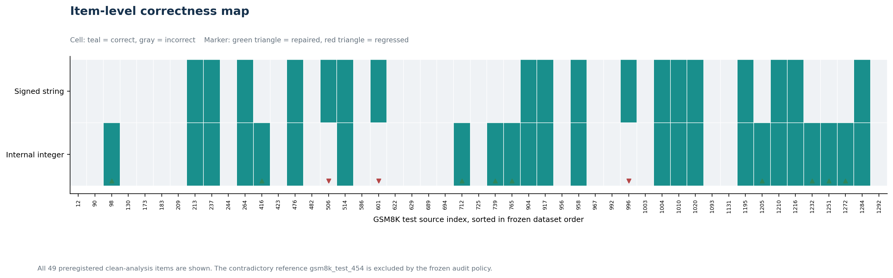

# Contract Sensitivity Lab

An artifact-backed evaluation harness for measuring how model-facing structured
output contracts change semantic behavior, validity, and execution outcomes.

[Results](#principal-results) | [Alignment result](#contract-aligned-internal-representation) | [Corrected replication](#corrected-7b-replication) | [Canonical correction](#canonical-schema-equivalence-correction) | [Cross-family decision](#cross-family-replication-and-executable-gate) | [Paired evidence](#item-level-and-mechanism-evidence) |
[Study design](#study-design) |
[Reproduction](#reproduce-the-evaluation) | [Evidence](#evidence-map) |
[Public Kaggle artifacts](#public-kaggle-artifacts) |
[Progress presentation](#progress-presentation) |
[Technical articles](#technical-articles) |
[Limitations](#scope-and-limitations)

## Progress presentation

Watch this presentation for an overview of the project's progress, key findings,
and results to date.

[](https://youtu.be/82-3grLsO2M?si=e37WsDqnmG9DbTYY)

[Watch on YouTube](https://youtu.be/82-3grLsO2M?si=e37WsDqnmG9DbTYY)

## Central result

The general optimizing-transform thesis is **closed by the completed evidence**.
The supported contribution is a contract-sensitivity evaluation harness with a
secondary fail-closed schema linter.

The original Qwen2.5-7B study showed that constrained decoding solved schema
compliance while changing semantic behavior. Prompt-only JSON achieved 79.6%
recoverable GSM8K accuracy and 0% schema compliance; Outlines and XGrammar each
achieved 61.2% recoverable accuracy and 100% compliance. That -18.4 point paired
semantic effect motivated a narrow contract-alignment transform: let the model emit
a native integer, deterministically stringify it, then validate against the
unchanged caller-facing numeric-string schema.

The corrected Qwen replication estimated a +12.2 point recovery, from 18/49 to
24/49 contract-valid correct, with an interval of [0.0, 26.5] points. That was valid
but uncertain evidence and authorized a cross-family test, not a general claim.

The confirmatory gates moved in the opposite direction:

| Gate | Control | Integer treatment | Paired effect | Wins : losses | Decision |
|---|---:|---:|---:|---:|---|
| Corrected Qwen2.5-7B GSM8K, n=49 | 18/49 (36.7%) | 24/49 (49.0%) | +12.2 pp, CI [0.0, 26.5] | 9 : 3 | Scoped continuation at that gate |
| Llama 3.2 3B broad-string GSM8K, n=150 | 92/150 (61.3%) | 82/150 (54.7%) | -6.7 pp, CI [-12.7, -1.3] | 5 : 15 | Negative, schema mismatch later corrected |
| Llama 3.2 3B canonical-string correction, n=150 | 92/150 (61.3%) | 82/150 (54.7%) | -6.7 pp, CI [-12.7, -0.7] | 6 : 16 | Optimizer thesis closed |
| Llama 3.2 3B deterministic tool-dispatch pilot, n=30 | 26/30 (86.7%) | 24/30 (80.0%) | -6.7 pp, CI [-20.0, 6.7] | 1 : 3 | No evidence of practical benefit |


The initial Llama replication used 150 randomly selected, previously unseen items.
An external review then found that its string control accepted decimals, fractions,
comma grouping, and leading zeros while the compiler supported only canonical
integers. The preregistered correction generated one exact canonical-string control
arm and reused the immutable treatment. The negative estimate survived unchanged in
magnitude. All 22 corrected discordances were manually audited, with no sign,
parser, validator, transduction, or truncation explanation.


The bounded practical gate used pinned BFCL V4 `simple_python` cases, strict caller
contracts, deterministic tool dispatch, state receipts, exact argument and
post-state scoring, and 66 artifact-validated generations. It did not execute
arbitrary business functions. All calls were structurally valid and dispatchable in
both conditions. The loss came from argument semantics, not from the transducer or
validator.

The project therefore continues primarily as a **contract-sensitivity analyzer and
reproducible measurement harness**, not as a general optimizing compiler. A static
linter can flag boundaries that require measurement, but cannot promise which
representation will improve quality. The integer-to-string transducer remains a
supported contract-preserving utility, not a default optimization.

## Principal results

The primary 7B matrix contains 300 validated generations across six conditions. The
clean analysis retains 49 paired items per condition after applying one predeclared
dataset-quality exclusion.

| Qwen2.5-7B condition | Recoverable accuracy | Strict accuracy | Schema compliance |
|---|---:|---:|---:|
| Free response | 36/49 (73.5%) | n/a | n/a |
| Prompted JSON, reasoning first | 39/49 (79.6%) | 0/49 (0.0%) | 0.0% |
| Outlines, reasoning first | 30/49 (61.2%) | 30/49 (61.2%) | 100% |
| XGrammar, reasoning first | 30/49 (61.2%) | 30/49 (61.2%) | 100% |
| Prompted JSON, answer first | 11/49 (22.4%) | 8/49 (16.3%) | 65.3% |
| Outlines, answer first | 8/49 (16.3%) | 8/49 (16.3%) | 100% |

Two scoring views are reported deliberately:

- **Recoverable accuracy** asks whether the intended numeric value can be extracted,
  even if the response violates the schema.
- **Strict accuracy** requires a correct value inside a schema-compliant answer
  field. It measures immediately usable output under the declared contract.

The frozen primary outcome was strict accuracy. Under that outcome, constraints
improved usable correctness because the prompt-only model emitted every answer as an
unquoted JSON number instead of the required numeric string. The recoverable view
isolates semantic correctness and reveals the constraint-associated loss.


### Findings supported by the completed matrix

1. **Valid JSON is not equivalent to schema compliance.** The 7B prompt-only,
   reasoning-first condition produced 100% valid JSON and 0% schema-valid output.
2. **Grammar constraints act on semantics as well as syntax.** Outlines and XGrammar
   each lost 9 paired wins and gained none against the matched prompt-only condition.
3. **Field order was more influential than backend choice.** Moving the answer before
   the reasoning reduced recoverable accuracy by 57.1 points under prompting and
   strict accuracy by 44.9 points under Outlines.
4. **Aggregate ties do not imply identical behavior.** Outlines and XGrammar tied at
   30/49, but each uniquely solved one item; only 20/49 raw responses were
   byte-identical.
5. **The observed effect depends on model scale.** The matched 0.5B comparison did not
   detect a semantic constraint cost at this sample size and low base accuracy.
6. **Numerical precision was an experimental validity issue.** On the tested T4
   environment, 4-bit and FP16 paths corrupted tokens, while BF16 preserved structure
   but damaged digits. FP32 was required before the 7B outputs were accepted as task
   evidence.

The full statistical interpretation, prompt-development history, failure analysis,
and relationship to prior work are documented in the
[research report](docs/research-report.md).

## Contract-aligned internal representation

The initial matrix located a fidelity loss associated with a model-facing signed
numeric string. The representation-alignment gate tests a narrow, safe alternative:
the model generates a native JSON integer, the deterministic transducer converts it
to canonical base-10 text, and the rebuilt object is validated against the unchanged
external signed-string schema. No second model call, sign repair, rounding, or
heuristic coercion is allowed.


The targeted screen repaired 7/8 shared signed-string failures with Outlines and 8/8
with XGrammar. The preregistered historical full confirmation then retained the
recovery on the cleaned 49-item set. These values remain reproducible historical
evidence, but the corrected replication in the next section is authoritative for
current architecture decisions:

| Condition | Contract-valid correctness | Final external validity | Negative answers |
|---|---:|---:|---:|
| Outlines signed numeric string | 30/49 (61.2%) | 49/49 (100.0%) | 12/49 |
| Outlines native integer + transducer | 37/49 (75.5%) | 49/49 (100.0%) | 0/49 |
| XGrammar signed numeric string | 30/49 (61.2%) | 49/49 (100.0%) | 12/49 |
| XGrammar native integer + transducer | 37/49 (75.5%) | 49/49 (100.0%) | 0/49 |


The paired gain is +14.3 percentage points for both backends. Outlines has 8
treatment-only wins and 1 new loss (exact paired `p = 0.0391`). XGrammar has 10
treatment-only wins and 3 new losses (exact paired `p = 0.0923`). Those new misses
are retained in the report, so the result is a scoped recovery rather than a claim
of universal quality preservation.

The compact XGrammar boundary traces show that, at the internal integer answer
boundary, digits are legal and selected on the representative sign-loss cases. The
trace is consistent with the representation hypothesis but does not alone prove a
general causal account.

Both figures in this section are generated deterministically by
[`scripts/build_alignment_figures.py`](scripts/build_alignment_figures.py). The result
figure reads the accepted
[`paired-summary.json`](experiments/representation-alignment-gate/results/cloud-full/paired-summary.json);
its values are not manually entered into the artwork.

Read the complete, artifact-linked analysis in
[`docs/representation-alignment-results.md`](docs/representation-alignment-results.md).

## Corrected 7B replication

An end-to-end audit found three measurement risks before the compiler prototype was
allowed to advance:

1. The historical Outlines path could apply Qwen's chat template twice.
2. Generated-token counts were not defined identically across wrappers.
3. Backend whitespace policies were not canonicalized to the same compact JSON
   language.

The corrected runner passes raw project prompts to Outlines, applies the chat
template exactly once on every effective generation path, retokenizes visible output
for a backend-independent token metric, and pins compact JSON separators. The
correction was followed by a frozen four-condition, 200-generation Kaggle replication
on Qwen2.5-7B, not by reinterpreting the historical rows.


| Corrected representation | Contract-valid correct | Final external validity | Negative answers |
|---|---:|---:|---:|
| Signed numeric string | 18/49 (36.7%) | 49/49 (100.0%) | 2 |
| Internal integer plus deterministic stringification | 24/49 (49.0%) | 49/49 (100.0%) | 0 |

The paired estimate is +12.2 percentage points with an exact deterministic bootstrap
95% interval of `[0.0, 26.5]` points. There were nine repairs and three regressions,
with exact two-sided McNemar `p = 0.145996`. The point estimate clears the frozen
five-point continuation threshold, but conventional significance was not reached.


Outlines and XGrammar emitted byte-identical raw output for all 50 signed-string
items and all 50 integer items. This is useful implementation evidence but not two
independent semantic replications. Under matched canonical policies, the observed
item-level difference is attributable to the representation path rather than backend
identity in this run.



The run produced 200/200 expected rows, zero generation errors, zero cap hits, zero
blank outputs, zero internal or external validation failures, and three preregistered
boundary traces. An independent local validator reported zero failures and zero
warnings. One repaired final answer, `gsm8k_test_712`, still contradicts its own
reasoning, so the evidence supports improved final-answer fidelity rather than
improved reasoning faithfulness.

This result was **green for scoped continuation at the corrected Qwen gate**. The
implemented prototype has a canonical contract IR, deterministic and serializable
plans, conservative integer-string, key-alias, field-order, scratch-field, and
whitespace transforms, exact inverse transduction, final validation, and typed
fail-closed refusals. The later cross-family and executable gates did not reproduce
the quality improvement, so they supersede the overall product decision while
preserving this Qwen result as model-specific evidence.

Primary corrected evidence:

- [Frozen replication protocol](experiments/corrected-replication/protocol.md)
- [Independent artifact validation](experiments/corrected-replication/results/qwen2.5-7b-corrected/artifact-validation.json)
- [Exact paired summary](experiments/corrected-replication/results/qwen2.5-7b-corrected/paired-summary-exact.md)
- [Decision report](experiments/corrected-replication/results/qwen2.5-7b-corrected/decision-report.md)
- [Compiler prototype acceptance report](experiments/compiler-prototype-probes/acceptance-report.json)
- [Published corrected replication analysis](https://dev.to/vaibhav_mittal_ac22a2c5d6/i-found-a-runner-bug-re-ran-200-generations-and-the-effect-survived-o5c)

All corrected figures are generated directly from the checked-in decision, summary,
validation, and raw JSONL artifacts by
[`scripts/build_corrected_replication_figures.py`](scripts/build_corrected_replication_figures.py).

## Canonical schema-equivalence correction

An external artifact review identified one important mismatch in the Llama
replication. The original signed-string control used a broad numeric language:

```text
integers + decimals + fractions + comma grouping + leading zeros
```

The safe compiler transform supports only this canonical language:

```regex
^-?(?:0|[1-9][0-9]*)$
```

Eight observed broad-control outputs were outside the compiler's supported
language. All eight were incorrect in both arms, so they did not directly explain
the earlier net loss, but the mismatch prevented a claim about exact schema
equivalence.

The correction was preregistered before generation. It reused the same Llama
revision, 150-item unseen holdout, prompt, XGrammar 0.2.3 backend, package and GPU
environment, greedy FP32 decoding, seed, and immutable integer-treatment artifact.
Only one new 150-row canonical-string arm was generated.


| Canonical correction metric | String control | Integer treatment |
|---|---:|---:|
| Contract-valid correctness | 92/150 (61.3%) | 82/150 (54.7%) |
| Semantic correctness | 92/150 (61.3%) | 82/150 (54.7%) |
| Final external validity | 150/150 (100.0%) | 149/150 (99.3%) |
| Internal schema validity | 150/150 (100.0%) | 149/150 (99.3%) |
| Errors | 0 | 0 |
| Token-cap hits | 0 | 1 |

The paired treatment-minus-control effect is **-6.7 points**, with exact paired
bootstrap interval **[-12.7, -0.7]**, 6 treatment-only wins, 16 control-only wins,
and exact McNemar `p = 0.05248`. The interval and exact test are reported separately.
The preregistered decision did not require a significance label: if the exact
canonical control still beat treatment, the optimizer thesis closed. It did, by ten
net items.

Every discordance was inspected. The 22 cases contained 10 problem-interpretation
changes, 8 reasoning and final-answer inconsistencies, 3 arithmetic regressions,
and 1 arithmetic correction. There were zero sign-boundary, parser, validator,
truncation, or transduction cases. The result supports a broader systems finding:
model-facing schemas are semantic context, not transparent serialization wrappers.

Complete correction evidence:

- [Preregistered protocol](experiments/canonical-schema-equivalence-correction/protocol.md)
- [Operational canary gate](experiments/canonical-schema-equivalence-correction/canary-gate.json)
- [Artifact validation](experiments/canonical-schema-equivalence-correction/artifact-validation.json)
- [Paired summary](experiments/canonical-schema-equivalence-correction/paired-summary.md)
- [Complete discordance audit](experiments/canonical-schema-equivalence-correction/failure-attribution.jsonl)
- [Final decision](experiments/canonical-schema-equivalence-correction/decision-report.md)

The figure is generated directly from the paired summary and item-level audit by
[`scripts/build_canonical_correction_figure.py`](scripts/build_canonical_correction_figure.py).

## Cross-family replication and executable gate

The independent replication changed the model family to
`meta-llama/Llama-3.2-3B-Instruct`, froze the exact model and tokenizer revision,
used one shared XGrammar runner for both representations, and placed 150 randomly
selected unseen GSM8K items in the confirmatory role. The historical cleaned 49-item
set remained a bridge comparison only.

| Llama set | String control | Integer treatment | Paired difference | Treatment-only | Control-only |
|---|---:|---:|---:|---:|---:|
| Fresh unseen, broad numeric string, n=150 | 92 (61.3%) | 82 (54.7%) | -6.7 pp, CI [-12.7, -1.3] | 5 | 15 |
| Fresh unseen, canonical integer string, n=150 | 92 (61.3%) | 82 (54.7%) | -6.7 pp, CI [-12.7, -0.7] | 6 | 16 |
| Bridge, n=49 | 21 (42.9%) | 20 (40.8%) | -2.0 pp, CI [-10.2, 6.1] | 2 | 3 |

The broad-string fresh result reached its preregistered Red gate. Its exact McNemar
p-value was 0.0414. The later canonical correction is authoritative for the exact
compiler-supported language and independently closes the optimizer claim under its
own frozen interpretation rule. Treatment final external validity was 149/150
because one token-cap failure remained in the denominator. All 80 post-result
Outlines parity outputs from the initial replication matched XGrammar byte for byte.

The Red path authorized one bounded practical tool-call pilot. It used a pinned BFCL
V4 `simple_python` foundation, a 30-case random primary sample, a separate 3-case
negative-sign stress set, and deterministic local wrappers with no external side
effects. This is an executable contract study built from BFCL cases and official
acceptable arguments, not a claim of an official BFCL leaderboard score.


| Executable primary metric | String control | Integer treatment |
|---|---:|---:|
| Executable-contract success | 26/30 (86.7%) | 24/30 (80.0%) |
| Internal-schema validity | 30/30 (100.0%) | 30/30 (100.0%) |
| Reconstructed external validity | 30/30 (100.0%) | 30/30 (100.0%) |
| Exact argument semantics | 26/30 (86.7%) | 24/30 (80.0%) |
| Execution acceptance | 30/30 (100.0%) | 30/30 (100.0%) |
| Correct post-execution state | 26/30 (86.7%) | 24/30 (80.0%) |

The paired pilot effect was -6.7 points with an interval of [-20.0, 6.7], 1
treatment-only win, 3 control-only wins, and exact McNemar p = 0.625. Every one of
the five discordant primary or stress cases was inspected. There were 2 semantic
corrections and 3 semantic regressions. Neither correction fixed a signed numeric
value; both changed an unrelated string field. The separate three-case sign-stress
estimate was positive but did not show a direct sign repair and is too small to
override the primary gate.

The final decision is closed for the general optimizing transform. The architecture
now distinguishes two claims:

- deterministic integer-to-string transduction is contract-preserving and supported;
- using the transform to improve model quality by default is rejected by current
  cross-family and practical evidence.

Complete evidence:

- [Second-family frozen protocol](experiments/second-family-replication/protocol.md)
- [Second-family paired summary](experiments/second-family-replication/paired-summary.md)
- [Second-family decision report](experiments/second-family-replication/decision-report.md)
- [Outlines implementation-parity report](experiments/second-family-replication/parity-report.json)
- [Executable pilot frozen protocol](experiments/tool-call-gate/protocol.md)
- [Executable pilot artifact validation](experiments/tool-call-gate/artifact-validation.json)
- [Executable pilot paired summary](experiments/tool-call-gate/paired-summary.md)
- [Complete executable discordance audit](experiments/tool-call-gate/failure-attribution.jsonl)
- [Executable pilot decision report](experiments/tool-call-gate/decision-report.md)

Both figures are generated directly from the frozen machine-readable decisions and
paired summaries by
[`scripts/build_replication_gate_figures.py`](scripts/build_replication_gate_figures.py).

## Technical articles

The public engineering record on DEV Community follows the research from decoding
mechanics through controlled evaluation and contract-aligned recovery:

| Published | Article | Scope |
|---|---|---|
| 27 Jul 2026 | [Grammars are written in characters. Models emit tokens.](https://dev.to/vaibhav_mittal_ac22a2c5d6/grammars-are-written-in-characters-models-emit-tokens-1k07) | Token-level foundations of grammar-constrained decoding |
| 30 Jul 2026 | [I Expected JSON Grammar Masks to Kill Sampling Diversity. The Prompt Got There First.](https://dev.to/vaibhav_mittal_ac22a2c5d6/i-expected-json-grammar-masks-to-kill-sampling-diversity-the-prompt-got-there-first-55fj) | Early diversity investigation and prompt effects |
| 1 Aug 2026 | [Why "Return Valid JSON" Is Not a Decoding Constraint](https://dev.to/vaibhav_mittal_ac22a2c5d6/why-return-valid-json-is-not-a-decoding-constraint-2bl8) | Distinction between prompt instructions and enforced decoding constraints |
| 4 Aug 2026 | [Structured Output Fixed My JSON and Cut Math Accuracy by 18 Points](https://dev.to/vaibhav_mittal_ac22a2c5d6/structured-output-fixed-my-json-and-cut-math-accuracy-by-18-points-jm5) | Controlled 300-generation baseline study |
| 5 Aug 2026 | [Constraints Cost 18 Points. Compiling the Schema Recovered 14.](https://dev.to/vaibhav_mittal_ac22a2c5d6/constraints-cost-18-points-compiling-the-schema-recovered-14-1f72) | 222-generation contract-alignment follow-up |
| 7 Aug 2026 | [I Found a Runner Bug, Re-ran 200 Generations, and the Effect Survived](https://dev.to/vaibhav_mittal_ac22a2c5d6/i-found-a-runner-bug-re-ran-200-generations-and-the-effect-survived-o5c) | Corrected paired replication and scoped compiler decision |
| 7 Aug 2026 | [The Optimization Worked on Qwen. It Failed on Llama and Tool Calls.](https://dev.to/vaibhav_mittal_ac22a2c5d6/the-optimization-worked-on-qwen-it-failed-on-llama-and-tool-calls-40oe) | Cross-family non-replication, executable pilot, and final measurement-system direction |

The exact submitted sources for the artifact-backed experimental reports are
retained in
[`articles/devto-structured-output-study.md`](articles/devto-structured-output-study.md)
and
[`articles/devto-contract-alignment-followup.md`](articles/devto-contract-alignment-followup.md),
with the corrected replication source in
[`articles/devto-corrected-replication.md`](articles/devto-corrected-replication.md)
and the cross-family decision source in
[`articles/devto-cross-family-replication.md`](articles/devto-cross-family-replication.md).
The repository remains the canonical record for the complete methodology, raw
artifacts, validation reports, and reproducible analysis.

## Item-level and mechanism evidence

Aggregate percentages can hide whether a treatment changes the same items. The
paired matrices below classify every audited item by its control and treatment
outcomes. A loss is an item answered correctly by the control and incorrectly by the
treatment; a gain is the reverse.


| Paired comparison | Both correct | Lost | Gained | Both wrong | Exact McNemar p |
|---|---:|---:|---:|---:|---:|
| Prompted RF → Outlines RF | 30 | 9 | 0 | 10 | 0.003906 |
| Prompted RF → XGrammar RF | 30 | 9 | 0 | 10 | 0.003906 |
| Outlines RF ↔ XGrammar RF | 29 | 1 | 1 | 18 | 1.000000 |

The two grammar backends therefore have the same aggregate constrained effect
against prompting, but they are not behaviorally identical. Their direct comparison
contains two discordant items, one uniquely correct for each backend. Against the
prompted control, however, both show nine losses and no gains on recoverable
mathematical correctness.

### Output-field order as a causal variable

The answer-first conditions changed only the order of the required JSON fields. The
model, items, prompt content, schema, precision, decoding policy, and token budget
remained fixed within each paired comparison.


| System | Reasoning-first recoverable | Answer-first recoverable | Paired change (95% CI) | Exact p | Schema: RF → AF |
|---|---:|---:|---:|---:|---:|
| Prompt-only JSON | 79.6% | 22.4% | -57.1 pp (-71.4, -40.8) | 5.77e-8 | 0.0% → 65.3% |
| Outlines JSON | 61.2% | 16.3% | -44.9 pp (-59.2, -30.6) | 2.98e-6 | 100% → 100% |

This separates two effects that would otherwise be conflated. Answer-first prompting
improved schema compliance and strict accuracy, yet sharply reduced recoverable
mathematical accuracy. Under Outlines, schema compliance stayed fixed at 100%, so the
44.9-point decline cannot be explained by improved formatting. It is evidence that
generation order itself changed task behavior in this setup.

Both figures in this section are deterministic Matplotlib plots generated directly from
[`summary_clean.json`](results/qwen2.5-7b/primary/combined/summary_clean.json) by
[`scripts/build_figures.py`](scripts/build_figures.py). The plotted counts, rates,
paired effects, intervals, and p-values are not manually entered into the artwork.

## Study design


The comparison holds the dataset items, JSON prompt text, chat template, model,
precision, greedy decoding, token budget, and scoring code constant wherever a paired
contrast requires them to be constant.

| Component | Specification |
|---|---|
| Dataset | Deterministic 50-item sample from `openai/gsm8k` test, seed 0 |
| Dataset hash | `3639f2f6def0f50e02086bc91e6f4a45567c85aa9b0f498224cb9421400d812a` |
| Data audit | One contradictory reference row retained in raw scores and excluded from the predeclared clean analysis |
| Models | Qwen2.5-0.5B-Instruct and Qwen2.5-7B-Instruct |
| Decoding | Greedy, seed 0, maximum 256 generated tokens |
| Prompt formatting | `tokenizer.apply_chat_template(..., add_generation_prompt=True)` |
| Constraint backends | Outlines 1.3.2 and XGrammar 0.2.3 |
| Primary precision | FP32 |
| Uncertainty | Wilson group intervals and paired-bootstrap effect intervals |
| Paired tests | Two-sided exact McNemar tests over discordant items |
| Failure policy | Generation errors and token-cap hits remain in denominators |

Every raw result row records the source item, formatted prompt, raw output, parsed
fields, validity flags, strict and recoverable scores, latency, token counts, model
configuration, and run signature. The two accepted 7B runs were independently checked
for source hashes, planned item order, row counts, prompt version, precision, decoding
configuration, duplicates, errors, and cap hits.

## Repository structure

```text
constrained-decoding-lab/
|-- assets/figures/                 # deterministic, data-derived SVG figures
|-- data/                           # fixed evaluation subset and audit policy
|-- deployment/kaggle/
|   |-- kernel/                     # baseline Kaggle entry point and metadata
|   |-- source-snapshot/            # exact source used by accepted baseline runs
|   `-- corrected-replication/      # frozen corrected 7B execution bundle
|-- docs/
|   |-- methodology.md              # frozen analysis protocol
|   |-- research-report.md          # complete interpretation and limitations
|   |-- representation-alignment-results.md # accepted internal-representation result
|   |-- run-ledgers/                # version-by-version local and cloud evidence
|   `-- archive/                    # foundational probes and pilot record
|-- experiments/representation-alignment-gate/ # historical alignment evidence
|-- experiments/corrected-replication/ # corrected raw rows, validation, decision
|-- experiments/second-family-replication/ # unseen Llama replication and backend parity
|-- experiments/canonical-schema-equivalence-correction/ # exact-language correction
|-- experiments/tool-call-gate/       # bounded tool-dispatch and post-state pilot
|-- experiments/compiler-prototype-probes/ # local compiler acceptance evidence
|-- deployment/modal/                 # frozen Modal execution surfaces
|-- src/project_a/                  # contract IR, plans, transforms, and transducer
|-- results/
|   |-- diagnostics/                # failed and precision-diagnostic evidence
|   |-- pilots/                     # early local evaluation evidence
|   |-- qwen2.5-0.5b/primary/       # accepted local matrix
|   `-- qwen2.5-7b/primary/         # accepted cloud matrix and combined analysis
|-- scripts/                        # preparation, evaluation, analysis, validation
`-- tests/                          # scoring and summarization regression tests
```

The visible taxonomy is based on scientific role rather than calendar labels.
Historical prompt IDs and the external Kaggle dataset slug are preserved exactly
inside provenance records because changing them would rewrite the identity of runs
that already occurred.

## Reproduce the evaluation

### 1. Create the verified local environment

Artifact replay and the default test suite do not require Torch, CUDA, Outlines, or
XGrammar:

```bash
uv venv .venv --python 3.12
uv pip install --python .venv/bin/python -e ".[dev]"
source .venv/bin/activate
python -m pytest
python scripts/replay_artifacts.py \
  --scope all \
  --out /tmp/replay-validation.json
```

Install the pinned generation, backend, and analysis layers only when needed:

```bash
uv pip install --python .venv/bin/python \
  -r requirements-generation.txt \
  -r requirements-backends.txt \
  -r requirements-analysis.txt
python scripts/probe_environment.py
```

The verified local system used an NVIDIA RTX 4050 Laptop GPU with the CUDA 12.4
PyTorch build. Exact package and hardware observations are in
[`docs/environment.md`](docs/environment.md).

### 2. Recreate the deterministic subset

```bash
python scripts/prepare_dataset.py \
  --count 50 \
  --seed 0 \
  --force \
  --out data/gsm8k_50_seed0.jsonl
sha256sum data/gsm8k_50_seed0.jsonl
```

### 3. Run a resumable condition

```bash
python scripts/run_evaluation.py \
  --model Qwen/Qwen2.5-0.5B-Instruct \
  --dataset data/gsm8k_50_seed0.jsonl \
  --condition prompted_json_reasoning_first \
  --limit 50 \
  --seed 0 \
  --dtype float32 \
  --resume \
  --out results/reproductions/qwen2.5-0.5b/prompted_json_reasoning_first.jsonl
```

Supported conditions are `free`, `prompted_json_reasoning_first`,
`prompted_json_answer_first`, `outlines_json_reasoning_first`,
`outlines_json_answer_first`, and `xgrammar_json_reasoning_first`.

The runner flushes one JSONL record after each item and refuses to resume into an
output whose run signature does not match the requested configuration.

### 4. Summarize and validate

```bash
python scripts/summarize_results.py \
  results/reproductions/qwen2.5-0.5b/*.jsonl \
  --exclude-item-id gsm8k_test_454 \
  --out-json results/reproductions/qwen2.5-0.5b/summary.json \
  --out-md results/reproductions/qwen2.5-0.5b/summary.md

python -m pytest
python scripts/build_figures.py
python scripts/build_alignment_figures.py
python scripts/build_corrected_replication_figures.py
python scripts/build_replication_gate_figures.py
python scripts/build_canonical_correction_figure.py \
  --summary experiments/canonical-schema-equivalence-correction/paired-summary.json \
  --audit experiments/canonical-schema-equivalence-correction/failure-attribution.jsonl \
  --png assets/figures/canonical-schema-correction.png \
  --svg assets/figures/canonical-schema-correction.svg
```

The checked-in 7B artifacts should be validated against the frozen deployment
snapshot, not the subsequently extended reporting script. Exact commands are listed
in the [7B run ledger](docs/run-ledgers/qwen2.5-7b.md).

### 5. Reproduce the representation-alignment gate

The internal-representation runner is deliberately separate from the frozen baseline
runner. It emits both internal-schema and final-external-contract metrics, and it
refuses ambiguous transduction.

```bash
PYTHONPATH=src python scripts/run_representation_alignment.py \
  --model Qwen/Qwen2.5-0.5B-Instruct \
  --dataset data/gsm8k_50_seed0.jsonl \
  --condition outlines_json_integer_reasoning_first \
  --limit 5 --seed 0 --dtype float32 \
  --out results/reproductions/alignment/outlines-integer.jsonl
```

The accepted 7B target and full-confirmation artifacts, source hashes, manifests,
and compact boundary traces are in
[`experiments/representation-alignment-gate/`](experiments/representation-alignment-gate/).

### 6. Validate the corrected replication

```bash
python scripts/validate_corrected_replication.py \
  --run-dir experiments/corrected-replication/results/qwen2.5-7b-corrected/results/corrected-replication \
  --dataset data/gsm8k_50_seed0.jsonl \
  --source-root deployment/kaggle/corrected-replication/source-snapshot \
  --kernel-source deployment/kaggle/corrected-replication/run_kaggle.py \
  --out /tmp/corrected-artifact-validation.json

python scripts/summarize_alignment_gate.py \
  experiments/corrected-replication/results/qwen2.5-7b-corrected/results/corrected-replication/*.jsonl \
  --exclude-item-id gsm8k_test_454 \
  --comparison outlines_integer_vs_signed outlines_json_integer_reasoning_first outlines_json_reasoning_first \
  --comparison xgrammar_integer_vs_signed xgrammar_json_integer_reasoning_first xgrammar_json_reasoning_first \
  --out-json /tmp/corrected-paired-summary.json \
  --out-md /tmp/corrected-paired-summary.md
```

The validator checks row counts, item identity, condition signatures, source and
runner hashes, prompt equivalence, backend output equivalence, errors, cap hits,
schema validity, and trace completeness. It does not trust the remote summary as its
own proof.

### 7. Validate the cross-family and executable gates

```bash
python scripts/validate_second_family_artifacts.py \
  --run-dir experiments/second-family-replication \
  --fresh-dataset data/gsm8k_unseen_150_seed20260815.jsonl \
  --bridge-dataset data/gsm8k_50_seed0.jsonl \
  --source-root . \
  --out /tmp/second-family-validation.json \
  --require-analysis

python scripts/validate_tool_call_artifacts.py \
  --run-dir experiments/tool-call-gate \
  --dataset data/bfcl_tool_pilot_seed20260817.jsonl \
  --source-root . \
  --out /tmp/tool-call-validation.json \
  --require-analysis
```

The second-family validator binds 398 XGrammar rows to the unseen and bridge dataset
hashes, source snapshot, paired run configurations, model revision, environment, and
complete manual audit. The tool-dispatch validator binds 66 rows to the pinned BFCL
foundation, dataset, source manifest, canary, run signatures, transduction, and
discordance audit.

### 8. Validate the canonical correction

```bash
python scripts/validate_canonical_correction_artifacts.py \
  --run-dir experiments/canonical-schema-equivalence-correction \
  --dataset data/gsm8k_unseen_150_seed20260815.jsonl \
  --source-root . \
  --historical-control experiments/second-family-replication/results/fresh/xgrammar_json_reasoning_first.jsonl \
  --frozen-treatment experiments/second-family-replication/results/fresh/xgrammar_json_integer_reasoning_first.jsonl \
  --frozen-treatment-manifest experiments/second-family-replication/manifests/fresh/xgrammar_json_integer_reasoning_first.json \
  --out /tmp/canonical-correction-validation.json \
  --require-analysis
```

This validator checks the source commit and file hashes, exact dataset order, prompt
parity, one chat-template application, model and tokenizer revisions, environment
parity, immutable treatment hash, score replay, complete audit, and final report.

## Public Kaggle artifacts

The cloud execution surface and its frozen source input are publicly accessible:

- [Qwen2.5-7B evaluation notebook](https://www.kaggle.com/code/vaibhav7011/constrained-decoding-qwen7b-evaluation)
- [Accepted reasoning-first run, version 22](https://www.kaggle.com/code/vaibhav7011/constrained-decoding-qwen7b-evaluation?scriptVersionId=339899508)
- [Accepted answer-first run, version 23](https://www.kaggle.com/code/vaibhav7011/constrained-decoding-qwen7b-evaluation?scriptVersionId=339962138)
- [Frozen evaluation source dataset](https://www.kaggle.com/datasets/vaibhav7011/constrained-decoding-day3-source)

The notebook version history preserves the cloud execution record. The accepted
reasoning-first and answer-first bundles are also checked into this repository and
validated independently, so the reported conclusions do not depend on Kaggle UI
availability.

## Evidence map

| Evidence | Location |
|---|---|
| Complete results and interpretation | [`docs/research-report.md`](docs/research-report.md) |
| Published constrained-decoding article series | [Technical articles](#technical-articles) |
| Baseline study article | [Structured Output Fixed My JSON and Cut Math Accuracy by 18 Points](https://dev.to/vaibhav_mittal_ac22a2c5d6/structured-output-fixed-my-json-and-cut-math-accuracy-by-18-points-jm5) |
| Baseline article source | [`articles/devto-structured-output-study.md`](articles/devto-structured-output-study.md) |
| Contract-alignment article | [Constraints Cost 18 Points. Compiling the Schema Recovered 14.](https://dev.to/vaibhav_mittal_ac22a2c5d6/constraints-cost-18-points-compiling-the-schema-recovered-14-1f72) |
| Contract-alignment article source | [`articles/devto-contract-alignment-followup.md`](articles/devto-contract-alignment-followup.md) |
| Corrected replication article | [I Found a Runner Bug, Re-ran 200 Generations, and the Effect Survived](https://dev.to/vaibhav_mittal_ac22a2c5d6/i-found-a-runner-bug-re-ran-200-generations-and-the-effect-survived-o5c) |
| Corrected replication article source | [`articles/devto-corrected-replication.md`](articles/devto-corrected-replication.md) |
| Cross-family decision article | [The Optimization Worked on Qwen. It Failed on Llama and Tool Calls.](https://dev.to/vaibhav_mittal_ac22a2c5d6/the-optimization-worked-on-qwen-it-failed-on-llama-and-tool-calls-40oe) |
| Cross-family decision article source | [`articles/devto-cross-family-replication.md`](articles/devto-cross-family-replication.md) |
| Frozen analysis protocol | [`docs/methodology.md`](docs/methodology.md) |
| 7B execution and failure ledger | [`docs/run-ledgers/qwen2.5-7b.md`](docs/run-ledgers/qwen2.5-7b.md) |
| 0.5B execution ledger | [`docs/run-ledgers/qwen2.5-0.5b.md`](docs/run-ledgers/qwen2.5-0.5b.md) |
| Combined 7B aggregate results | [`summary_clean.md`](results/qwen2.5-7b/primary/combined/summary_clean.md) |
| Combined 7B item matrix | [`items.md`](results/qwen2.5-7b/primary/combined/items.md) |
| 7B reasoning-first validation | [`artifact_validation.json`](results/qwen2.5-7b/primary/reasoning-first/artifact_validation.json) |
| 7B answer-first validation | [`artifact_validation.json`](results/qwen2.5-7b/primary/answer-first/artifact_validation.json) |
| Representation-alignment decision report | [`representation-alignment-results.md`](docs/representation-alignment-results.md) |
| Targeted gate validation | [`artifact-validation.json`](experiments/representation-alignment-gate/results/cloud-targeted/artifact-validation.json) |
| Full confirmation validation | [`artifact-validation.json`](experiments/representation-alignment-gate/results/cloud-full/artifact-validation.json) |
| Full paired comparison | [`paired-summary.md`](experiments/representation-alignment-gate/results/cloud-full/paired-summary.md) |
| Corrected replication protocol | [`protocol.md`](experiments/corrected-replication/protocol.md) |
| Corrected artifact validation | [`artifact-validation.json`](experiments/corrected-replication/results/qwen2.5-7b-corrected/artifact-validation.json) |
| Corrected exact paired summary | [`paired-summary-exact.md`](experiments/corrected-replication/results/qwen2.5-7b-corrected/paired-summary-exact.md) |
| Corrected architecture decision | [`decision-report.md`](experiments/corrected-replication/results/qwen2.5-7b-corrected/decision-report.md) |
| Compiler prototype acceptance | [`acceptance-report.json`](experiments/compiler-prototype-probes/acceptance-report.json) |
| Current evidence status and product direction | [`evidence-status.md`](docs/evidence-status.md) |
| Second-family preregistration | [`protocol.md`](experiments/second-family-replication/protocol.md) |
| Second-family artifact validation | [`artifact-validation.json`](experiments/second-family-replication/artifact-validation.json) |
| Second-family paired summary | [`paired-summary.md`](experiments/second-family-replication/paired-summary.md) |
| Second-family Red decision | [`decision-report.md`](experiments/second-family-replication/decision-report.md) |
| Outlines implementation parity | [`parity-report.json`](experiments/second-family-replication/parity-report.json) |
| Canonical correction preregistration | [`protocol.md`](experiments/canonical-schema-equivalence-correction/protocol.md) |
| Canonical correction artifact validation | [`artifact-validation.json`](experiments/canonical-schema-equivalence-correction/artifact-validation.json) |
| Canonical correction paired summary | [`paired-summary.md`](experiments/canonical-schema-equivalence-correction/paired-summary.md) |
| Canonical correction complete audit | [`failure-attribution.jsonl`](experiments/canonical-schema-equivalence-correction/failure-attribution.jsonl) |
| Canonical correction final decision | [`decision-report.md`](experiments/canonical-schema-equivalence-correction/decision-report.md) |
| One-command prior-artifact replay | [`replay-validation.json`](experiments/replay-validation.json) |
| Executable pilot preregistration | [`protocol.md`](experiments/tool-call-gate/protocol.md) |
| Executable pilot artifact validation | [`artifact-validation.json`](experiments/tool-call-gate/artifact-validation.json) |
| Executable pilot paired summary | [`paired-summary.md`](experiments/tool-call-gate/paired-summary.md) |
| Executable pilot discordance audit | [`failure-attribution.jsonl`](experiments/tool-call-gate/failure-attribution.jsonl) |
| Executable pilot Red decision | [`decision-report.md`](experiments/tool-call-gate/decision-report.md) |
| 0.5B accepted aggregate results | [`summary_clean.md`](results/qwen2.5-0.5b/primary/summary_clean.md) |
| Machine-readable data audit | [`gsm8k_item_audit.json`](data/gsm8k_item_audit.json) |
| Exact accepted cloud source | [`deployment/kaggle/source-snapshot/`](deployment/kaggle/source-snapshot/) |
| Public reasoning-first execution | [Kaggle version 22](https://www.kaggle.com/code/vaibhav7011/constrained-decoding-qwen7b-evaluation?scriptVersionId=339899508) |
| Public answer-first execution | [Kaggle version 23](https://www.kaggle.com/code/vaibhav7011/constrained-decoding-qwen7b-evaluation?scriptVersionId=339962138) |
| Public frozen cloud input | [Kaggle dataset](https://www.kaggle.com/datasets/vaibhav7011/constrained-decoding-day3-source) |

## Is more cloud compute required?

No additional cloud run is required to decide the current research question. The
exact canonical schema correction is complete, artifact-validated, manually audited,
and closes the default optimizer thesis under its preregistered interpretation. The
independent model-family replication and bounded tool-dispatch pilot remain
preserved as earlier gates.

Repeating the same Qwen or Llama matrices, trying alternative prompts after seeing
the outcomes, or searching model families for another positive result would not add
credible evidence to the closed optimizer claim.

A future cloud study is justified only for a new question: whether the schema-risk
analyzer's warnings and paired measurements predict real deployment regressions
across independent structured-output workloads. That requires its own protocol,
holdout, and decision gate. It is product validation for the measurement system, not
another attempt to rescue the rejected transform.

## Scope and limitations

- The evidence covers Qwen2.5 and Llama 3.2 model families, GSM8K and a bounded
  BFCL-based executable-call pilot, greedy decoding, FP32, and XGrammar. Outlines was
  used for exact implementation parity, not as a second statistical result.
- The positive corrected Qwen sample contains 49 audited items and its interval
  touches zero. The unseen Llama sample contains 150 items and its interval is below
  zero. The executable primary sample contains only 30 calls and remains uncertain.
- Prompt wording and field order are causal variables. Earlier prompt probes changed
  apparent backend effects and are retained as diagnostics rather than pooled.
- The T4 precision failures are properties of the tested software and hardware path,
  not evidence that those dtypes fail universally.
- Latency is descriptive because output lengths differ and FP32 inference on T4 is
  not an optimized serving configuration.
- The executable pilot adapts official BFCL cases and acceptable arguments to a
  project-defined numeric-string external contract. It is not an official BFCL
  leaderboard evaluation and does not execute original business functions.
- The results reproduce and sharpen known concerns about semantic sensitivity under
  rigid output contracts. They do not establish a universal law or claim invention
  of constrained decoding.
- Byte-identical Outlines and XGrammar rows validate implementation agreement on the
  tested subsets but are not independent semantic replications.
- One correct treatment answer contradicts its own reasoning, so benchmark accuracy
  must not be presented as reasoning faithfulness.

## Citation

If this repository informs research or engineering work, cite the archived revision
you used. Repository metadata is also available in [`CITATION.cff`](CITATION.cff).

```bibtex
@software{mittal_constrained_decoding_matched,
  author  = {Vaibhav Mittal},
  title   = {Constrained Decoding Under Matched Conditions},
  year    = {2026},
  url     = {https://github.com/Vaibhav701161/constrained-decoding-lab}
}
```
