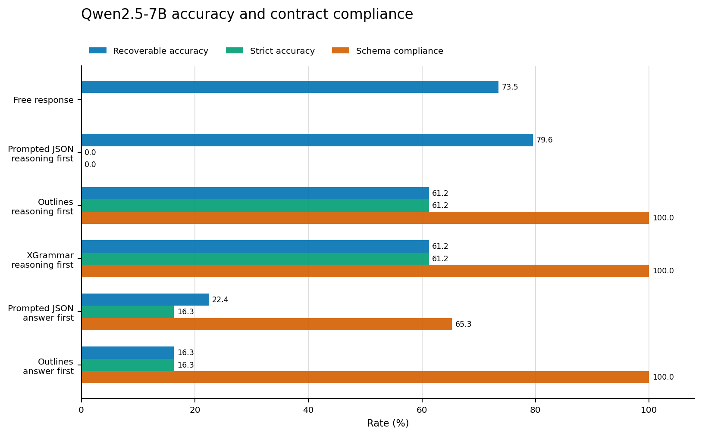
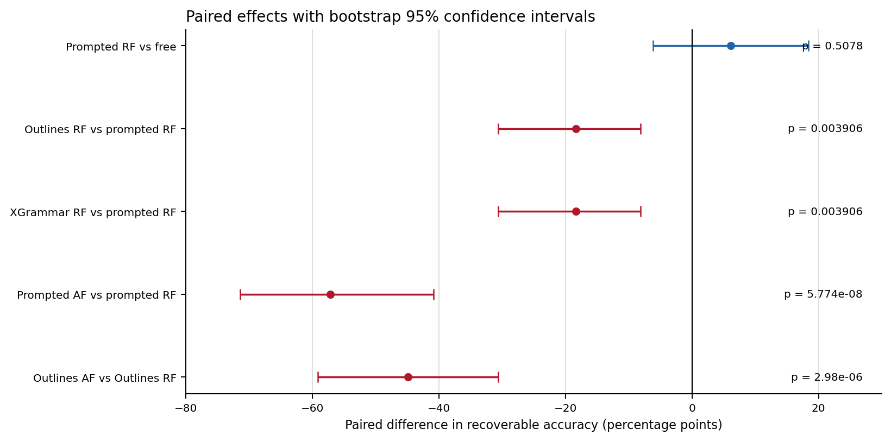
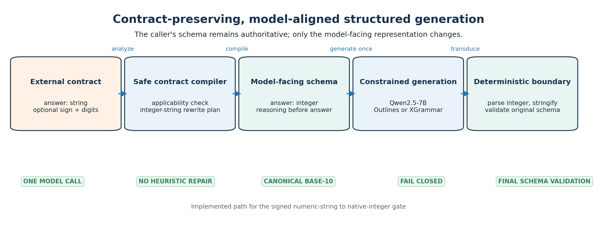
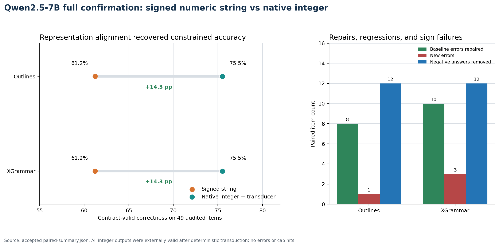
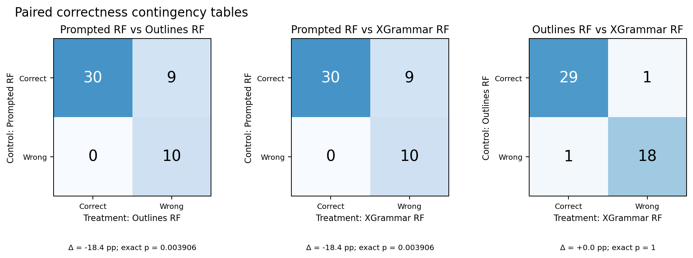
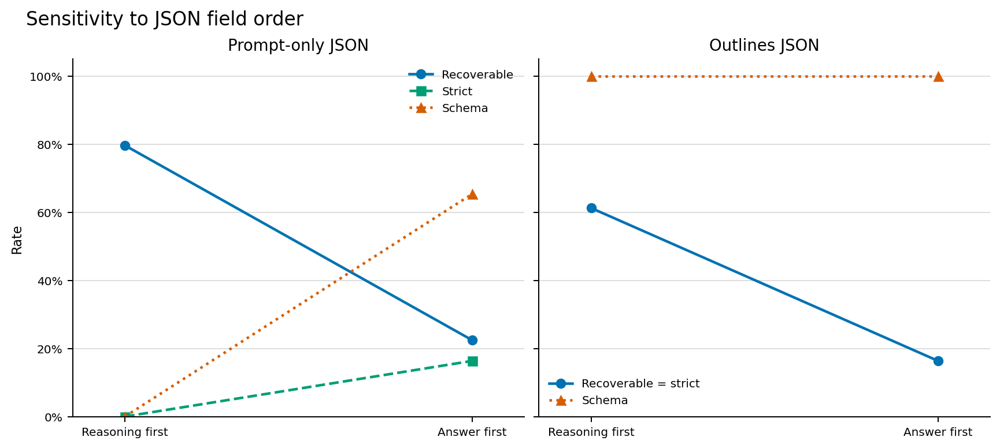
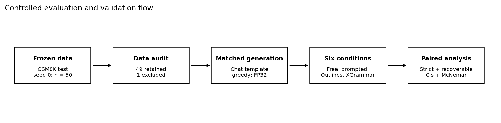

# Constrained Decoding Under Matched Conditions

A controlled, artifact-validated study of how JSON prompting, grammar-constrained
decoding, and output-field order affect mathematical accuracy and schema compliance.

[Results](#principal-results) | [Alignment result](#contract-aligned-internal-representation) | [Paired evidence](#item-level-and-mechanism-evidence) |
[Study design](#study-design) |
[Reproduction](#reproduce-the-evaluation) | [Evidence](#evidence-map) |
[Public Kaggle artifacts](#public-kaggle-artifacts) |
[Progress presentation](#progress-presentation) |
[Technical articles](#technical-articles) |
[Limitations](#scope-and-limitations)

## Progress presentation

Watch this presentation for an overview of the project's progress, key findings,
and results to date.

[](https://youtu.be/82-3grLsO2M?si=e37WsDqnmG9DbTYY)

[Watch on YouTube](https://youtu.be/82-3grLsO2M?si=e37WsDqnmG9DbTYY)

## Central result

Constrained decoding solved the formatting problem, but it did not preserve all of
the model's recoverable mathematical accuracy. On Qwen2.5-7B, prompt-only JSON
achieved 79.6% recoverable accuracy and 0% schema compliance. Outlines and XGrammar
each achieved 61.2% recoverable accuracy and 100% schema compliance. The paired
semantic effect was -18.4 percentage points for both backends (exact McNemar
`p = 0.003906`).

This is not a claim that constrained decoding is universally harmful. It is a
controlled reproduction showing that contract compliance and semantic correctness
are separate outcomes, and that a decoder can improve the first while reducing the
second under a specific, matched setup.

The completed follow-up isolates a practical recovery mechanism for this setup:
compile the external signed numeric-string contract into a native JSON-integer
internal representation, generate under the internal grammar, then deterministically
stringify and validate the external response. On the same cleaned 49-item set, this
recovered both constrained backends from 30/49 to 37/49 contract-valid correct while
retaining 100% external validity.



## Principal results

The primary 7B matrix contains 300 validated generations across six conditions. The
clean analysis retains 49 paired items per condition after applying one predeclared
dataset-quality exclusion.

| Qwen2.5-7B condition | Recoverable accuracy | Strict accuracy | Schema compliance |
|---|---:|---:|---:|
| Free response | 36/49 (73.5%) | n/a | n/a |
| Prompted JSON, reasoning first | 39/49 (79.6%) | 0/49 (0.0%) | 0.0% |
| Outlines, reasoning first | 30/49 (61.2%) | 30/49 (61.2%) | 100% |
| XGrammar, reasoning first | 30/49 (61.2%) | 30/49 (61.2%) | 100% |
| Prompted JSON, answer first | 11/49 (22.4%) | 8/49 (16.3%) | 65.3% |
| Outlines, answer first | 8/49 (16.3%) | 8/49 (16.3%) | 100% |

Two scoring views are reported deliberately:

- **Recoverable accuracy** asks whether the intended numeric value can be extracted,
  even if the response violates the schema.
- **Strict accuracy** requires a correct value inside a schema-compliant answer
  field. It measures immediately usable output under the declared contract.

The frozen primary outcome was strict accuracy. Under that outcome, constraints
improved usable correctness because the prompt-only model emitted every answer as an
unquoted JSON number instead of the required numeric string. The recoverable view
isolates semantic correctness and reveals the constraint-associated loss.



### Findings supported by the completed matrix

1. **Valid JSON is not equivalent to schema compliance.** The 7B prompt-only,
   reasoning-first condition produced 100% valid JSON and 0% schema-valid output.
2. **Grammar constraints act on semantics as well as syntax.** Outlines and XGrammar
   each lost 9 paired wins and gained none against the matched prompt-only condition.
3. **Field order was more influential than backend choice.** Moving the answer before
   the reasoning reduced recoverable accuracy by 57.1 points under prompting and
   strict accuracy by 44.9 points under Outlines.
4. **Aggregate ties do not imply identical behavior.** Outlines and XGrammar tied at
   30/49, but each uniquely solved one item; only 20/49 raw responses were
   byte-identical.
5. **The observed effect depends on model scale.** The matched 0.5B comparison did not
   detect a semantic constraint cost at this sample size and low base accuracy.
6. **Numerical precision was an experimental validity issue.** On the tested T4
   environment, 4-bit and FP16 paths corrupted tokens, while BF16 preserved structure
   but damaged digits. FP32 was required before the 7B outputs were accepted as task
   evidence.

The full statistical interpretation, prompt-development history, failure analysis,
and relationship to prior work are documented in the
[research report](docs/research-report.md).

## Contract-aligned internal representation

The initial matrix located a fidelity loss associated with a model-facing signed
numeric string. The representation-alignment gate tests a narrow, safe alternative:
the model generates a native JSON integer, the deterministic transducer converts it
to canonical base-10 text, and the rebuilt object is validated against the unchanged
external signed-string schema. No second model call, sign repair, rounding, or
heuristic coercion is allowed.



The targeted screen repaired 7/8 shared signed-string failures with Outlines and 8/8
with XGrammar. The preregistered full confirmation then retained the recovery on the
cleaned 49-item set:

| Condition | Contract-valid correctness | Final external validity | Negative answers |
|---|---:|---:|---:|
| Outlines signed numeric string | 30/49 (61.2%) | 49/49 (100.0%) | 12/49 |
| Outlines native integer + transducer | 37/49 (75.5%) | 49/49 (100.0%) | 0/49 |
| XGrammar signed numeric string | 30/49 (61.2%) | 49/49 (100.0%) | 12/49 |
| XGrammar native integer + transducer | 37/49 (75.5%) | 49/49 (100.0%) | 0/49 |



The paired gain is +14.3 percentage points for both backends. Outlines has 8
treatment-only wins and 1 new loss (exact paired `p = 0.0391`). XGrammar has 10
treatment-only wins and 3 new losses (exact paired `p = 0.0923`). Those new misses
are retained in the report, so the result is a scoped recovery rather than a claim
of universal quality preservation.

The compact XGrammar boundary traces show that, at the internal integer answer
boundary, digits are legal and selected on the representative sign-loss cases. The
trace is consistent with the representation hypothesis but does not alone prove a
general causal account.

Both figures in this section are generated deterministically by
[`scripts/build_alignment_figures.py`](scripts/build_alignment_figures.py). The result
figure reads the accepted
[`paired-summary.json`](experiments/representation-alignment-gate/results/cloud-full/paired-summary.json);
its values are not manually entered into the artwork.

Read the complete, artifact-linked analysis in
[`docs/representation-alignment-results.md`](docs/representation-alignment-results.md).

## Technical articles

The public engineering record on DEV Community follows the research from decoding
mechanics through controlled evaluation and contract-aligned recovery:

| Published | Article | Scope |
|---|---|---|
| 27 Jul 2026 | [Grammars are written in characters. Models emit tokens.](https://dev.to/vaibhav_mittal_ac22a2c5d6/grammars-are-written-in-characters-models-emit-tokens-1k07) | Token-level foundations of grammar-constrained decoding |
| 30 Jul 2026 | [I Expected JSON Grammar Masks to Kill Sampling Diversity. The Prompt Got There First.](https://dev.to/vaibhav_mittal_ac22a2c5d6/i-expected-json-grammar-masks-to-kill-sampling-diversity-the-prompt-got-there-first-55fj) | Early diversity investigation and prompt effects |
| 1 Aug 2026 | [Why "Return Valid JSON" Is Not a Decoding Constraint](https://dev.to/vaibhav_mittal_ac22a2c5d6/why-return-valid-json-is-not-a-decoding-constraint-2bl8) | Distinction between prompt instructions and enforced decoding constraints |
| 4 Aug 2026 | [Structured Output Fixed My JSON and Cut Math Accuracy by 18 Points](https://dev.to/vaibhav_mittal_ac22a2c5d6/structured-output-fixed-my-json-and-cut-math-accuracy-by-18-points-jm5) | Controlled 300-generation baseline study |
| 5 Aug 2026 | [Constraints Cost 18 Points. Compiling the Schema Recovered 14.](https://dev.to/vaibhav_mittal_ac22a2c5d6/constraints-cost-18-points-compiling-the-schema-recovered-14-1f72) | 222-generation contract-alignment follow-up |

The exact submitted sources for the two artifact-backed experimental reports are
retained in
[`articles/devto-structured-output-study.md`](articles/devto-structured-output-study.md)
and
[`articles/devto-contract-alignment-followup.md`](articles/devto-contract-alignment-followup.md).
The repository remains the canonical record for the complete methodology, raw
artifacts, validation reports, and reproducible analysis.

## Item-level and mechanism evidence

Aggregate percentages can hide whether a treatment changes the same items. The
paired matrices below classify every audited item by its control and treatment
outcomes. A loss is an item answered correctly by the control and incorrectly by the
treatment; a gain is the reverse.



| Paired comparison | Both correct | Lost | Gained | Both wrong | Exact McNemar p |
|---|---:|---:|---:|---:|---:|
| Prompted RF → Outlines RF | 30 | 9 | 0 | 10 | 0.003906 |
| Prompted RF → XGrammar RF | 30 | 9 | 0 | 10 | 0.003906 |
| Outlines RF ↔ XGrammar RF | 29 | 1 | 1 | 18 | 1.000000 |

The two grammar backends therefore have the same aggregate constrained effect
against prompting, but they are not behaviorally identical. Their direct comparison
contains two discordant items, one uniquely correct for each backend. Against the
prompted control, however, both show nine losses and no gains on recoverable
mathematical correctness.

### Output-field order as a causal variable

The answer-first conditions changed only the order of the required JSON fields. The
model, items, prompt content, schema, precision, decoding policy, and token budget
remained fixed within each paired comparison.



| System | Reasoning-first recoverable | Answer-first recoverable | Paired change (95% CI) | Exact p | Schema: RF → AF |
|---|---:|---:|---:|---:|---:|
| Prompt-only JSON | 79.6% | 22.4% | -57.1 pp (-71.4, -40.8) | 5.77e-8 | 0.0% → 65.3% |
| Outlines JSON | 61.2% | 16.3% | -44.9 pp (-59.2, -30.6) | 2.98e-6 | 100% → 100% |

This separates two effects that would otherwise be conflated. Answer-first prompting
improved schema compliance and strict accuracy, yet sharply reduced recoverable
mathematical accuracy. Under Outlines, schema compliance stayed fixed at 100%, so the
44.9-point decline cannot be explained by improved formatting. It is evidence that
generation order itself changed task behavior in this setup.

Both figures in this section are deterministic Matplotlib plots generated directly from
[`summary_clean.json`](results/qwen2.5-7b/primary/combined/summary_clean.json) by
[`scripts/build_figures.py`](scripts/build_figures.py). The plotted counts, rates,
paired effects, intervals, and p-values are not manually entered into the artwork.

## Study design



The comparison holds the dataset items, JSON prompt text, chat template, model,
precision, greedy decoding, token budget, and scoring code constant wherever a paired
contrast requires them to be constant.

| Component | Specification |
|---|---|
| Dataset | Deterministic 50-item sample from `openai/gsm8k` test, seed 0 |
| Dataset hash | `3639f2f6def0f50e02086bc91e6f4a45567c85aa9b0f498224cb9421400d812a` |
| Data audit | One contradictory reference row retained in raw scores and excluded from the predeclared clean analysis |
| Models | Qwen2.5-0.5B-Instruct and Qwen2.5-7B-Instruct |
| Decoding | Greedy, seed 0, maximum 256 generated tokens |
| Prompt formatting | `tokenizer.apply_chat_template(..., add_generation_prompt=True)` |
| Constraint backends | Outlines 1.3.2 and XGrammar 0.2.3 |
| Primary precision | FP32 |
| Uncertainty | Wilson group intervals and paired-bootstrap effect intervals |
| Paired tests | Two-sided exact McNemar tests over discordant items |
| Failure policy | Generation errors and token-cap hits remain in denominators |

Every raw result row records the source item, formatted prompt, raw output, parsed
fields, validity flags, strict and recoverable scores, latency, token counts, model
configuration, and run signature. The two accepted 7B runs were independently checked
for source hashes, planned item order, row counts, prompt version, precision, decoding
configuration, duplicates, errors, and cap hits.

## Repository structure

```text
constrained-decoding-lab/
|-- assets/figures/                 # deterministic, data-derived SVG figures
|-- data/                           # fixed evaluation subset and audit policy
|-- deployment/kaggle/
|   |-- kernel/                     # Kaggle entry point and metadata
|   `-- source-snapshot/            # exact source used by accepted cloud runs
|-- docs/
|   |-- methodology.md              # frozen analysis protocol
|   |-- research-report.md          # complete interpretation and limitations
|   |-- representation-alignment-results.md # accepted internal-representation result
|   |-- run-ledgers/                # version-by-version local and cloud evidence
|   `-- archive/                    # foundational probes and pilot record
|-- experiments/representation-alignment-gate/ # protocol, schemas, traces, accepted raw rows
|-- src/project_a/                  # typed representation config and deterministic transducer
|-- results/
|   |-- diagnostics/                # failed and precision-diagnostic evidence
|   |-- pilots/                     # early local evaluation evidence
|   |-- qwen2.5-0.5b/primary/       # accepted local matrix
|   `-- qwen2.5-7b/primary/         # accepted cloud matrix and combined analysis
|-- scripts/                        # preparation, evaluation, analysis, validation
`-- tests/                          # scoring and summarization regression tests
```

The visible taxonomy is based on scientific role rather than calendar labels.
Historical prompt IDs and the external Kaggle dataset slug are preserved exactly
inside provenance records because changing them would rewrite the identity of runs
that already occurred.

## Reproduce the evaluation

### 1. Create the verified local environment

```bash
uv venv .venv --python 3.12
uv pip install --python .venv/bin/python -r requirements.txt
source .venv/bin/activate
python scripts/probe_environment.py
```

The verified local system used an NVIDIA RTX 4050 Laptop GPU with the CUDA 12.4
PyTorch build. Exact package and hardware observations are in
[`docs/environment.md`](docs/environment.md).

### 2. Recreate the deterministic subset

```bash
python scripts/prepare_dataset.py \
  --count 50 \
  --seed 0 \
  --force \
  --out data/gsm8k_50_seed0.jsonl
sha256sum data/gsm8k_50_seed0.jsonl
```

### 3. Run a resumable condition

```bash
python scripts/run_evaluation.py \
  --model Qwen/Qwen2.5-0.5B-Instruct \
  --dataset data/gsm8k_50_seed0.jsonl \
  --condition prompted_json_reasoning_first \
  --limit 50 \
  --seed 0 \
  --dtype float32 \
  --resume \
  --out results/reproductions/qwen2.5-0.5b/prompted_json_reasoning_first.jsonl
```

Supported conditions are `free`, `prompted_json_reasoning_first`,
`prompted_json_answer_first`, `outlines_json_reasoning_first`,
`outlines_json_answer_first`, and `xgrammar_json_reasoning_first`.

The runner flushes one JSONL record after each item and refuses to resume into an
output whose run signature does not match the requested configuration.

### 4. Summarize and validate

```bash
python scripts/summarize_results.py \
  results/reproductions/qwen2.5-0.5b/*.jsonl \
  --exclude-item-id gsm8k_test_454 \
  --out-json results/reproductions/qwen2.5-0.5b/summary.json \
  --out-md results/reproductions/qwen2.5-0.5b/summary.md

python -m unittest discover -s tests -v
python scripts/build_figures.py
```

The checked-in 7B artifacts should be validated against the frozen deployment
snapshot, not the subsequently extended reporting script. Exact commands are listed
in the [7B run ledger](docs/run-ledgers/qwen2.5-7b.md).

### 5. Reproduce the representation-alignment gate

The internal-representation runner is deliberately separate from the frozen baseline
runner. It emits both internal-schema and final-external-contract metrics, and it
refuses ambiguous transduction.

```bash
PYTHONPATH=src python scripts/run_representation_alignment.py \
  --model Qwen/Qwen2.5-0.5B-Instruct \
  --dataset data/gsm8k_50_seed0.jsonl \
  --condition outlines_json_integer_reasoning_first \
  --limit 5 --seed 0 --dtype float32 \
  --out results/reproductions/alignment/outlines-integer.jsonl
```

The accepted 7B target and full-confirmation artifacts, source hashes, manifests,
and compact boundary traces are in
[`experiments/representation-alignment-gate/`](experiments/representation-alignment-gate/).

## Public Kaggle artifacts

The cloud execution surface and its frozen source input are publicly accessible:

- [Qwen2.5-7B evaluation notebook](https://www.kaggle.com/code/vaibhav7011/constrained-decoding-qwen7b-evaluation)
- [Accepted reasoning-first run, version 22](https://www.kaggle.com/code/vaibhav7011/constrained-decoding-qwen7b-evaluation?scriptVersionId=339899508)
- [Accepted answer-first run, version 23](https://www.kaggle.com/code/vaibhav7011/constrained-decoding-qwen7b-evaluation?scriptVersionId=339962138)
- [Frozen evaluation source dataset](https://www.kaggle.com/datasets/vaibhav7011/constrained-decoding-day3-source)

The notebook version history preserves the cloud execution record. The accepted
reasoning-first and answer-first bundles are also checked into this repository and
validated independently, so the reported conclusions do not depend on Kaggle UI
availability.

## Evidence map

| Evidence | Location |
|---|---|
| Complete results and interpretation | [`docs/research-report.md`](docs/research-report.md) |
| Published constrained-decoding article series | [Technical articles](#technical-articles) |
| Baseline study article | [Structured Output Fixed My JSON and Cut Math Accuracy by 18 Points](https://dev.to/vaibhav_mittal_ac22a2c5d6/structured-output-fixed-my-json-and-cut-math-accuracy-by-18-points-jm5) |
| Baseline article source | [`articles/devto-structured-output-study.md`](articles/devto-structured-output-study.md) |
| Contract-alignment article | [Constraints Cost 18 Points. Compiling the Schema Recovered 14.](https://dev.to/vaibhav_mittal_ac22a2c5d6/constraints-cost-18-points-compiling-the-schema-recovered-14-1f72) |
| Contract-alignment article source | [`articles/devto-contract-alignment-followup.md`](articles/devto-contract-alignment-followup.md) |
| Frozen analysis protocol | [`docs/methodology.md`](docs/methodology.md) |
| 7B execution and failure ledger | [`docs/run-ledgers/qwen2.5-7b.md`](docs/run-ledgers/qwen2.5-7b.md) |
| 0.5B execution ledger | [`docs/run-ledgers/qwen2.5-0.5b.md`](docs/run-ledgers/qwen2.5-0.5b.md) |
| Combined 7B aggregate results | [`summary_clean.md`](results/qwen2.5-7b/primary/combined/summary_clean.md) |
| Combined 7B item matrix | [`items.md`](results/qwen2.5-7b/primary/combined/items.md) |
| 7B reasoning-first validation | [`artifact_validation.json`](results/qwen2.5-7b/primary/reasoning-first/artifact_validation.json) |
| 7B answer-first validation | [`artifact_validation.json`](results/qwen2.5-7b/primary/answer-first/artifact_validation.json) |
| Representation-alignment decision report | [`representation-alignment-results.md`](docs/representation-alignment-results.md) |
| Targeted gate validation | [`artifact-validation.json`](experiments/representation-alignment-gate/results/cloud-targeted/artifact-validation.json) |
| Full confirmation validation | [`artifact-validation.json`](experiments/representation-alignment-gate/results/cloud-full/artifact-validation.json) |
| Full paired comparison | [`paired-summary.md`](experiments/representation-alignment-gate/results/cloud-full/paired-summary.md) |
| 0.5B accepted aggregate results | [`summary_clean.md`](results/qwen2.5-0.5b/primary/summary_clean.md) |
| Machine-readable data audit | [`gsm8k_item_audit.json`](data/gsm8k_item_audit.json) |
| Exact accepted cloud source | [`deployment/kaggle/source-snapshot/`](deployment/kaggle/source-snapshot/) |
| Public reasoning-first execution | [Kaggle version 22](https://www.kaggle.com/code/vaibhav7011/constrained-decoding-qwen7b-evaluation?scriptVersionId=339899508) |
| Public answer-first execution | [Kaggle version 23](https://www.kaggle.com/code/vaibhav7011/constrained-decoding-qwen7b-evaluation?scriptVersionId=339962138) |
| Public frozen cloud input | [Kaggle dataset](https://www.kaggle.com/datasets/vaibhav7011/constrained-decoding-day3-source) |

## Is more cloud compute required?

No additional cloud run is required to support the current, narrow contract-alignment
conclusion. The frozen baseline and the accepted full representation-alignment
confirmation together establish the measured recovery on Qwen2.5-7B under the
declared setup.

More compute is required before making a broad claim about constrained decoding in
general. The highest-value follow-up is a mechanism test, not another copy of the
same matrix:

1. Replicate the safe internal representation on at least one independent model family.
2. Add an executable tool-call task and a schema-centric benchmark.
3. Test the other safe transforms only with their own preregistered mechanism tests.
4. Use a larger preregistered sample and an independent replication split.
5. Benchmark optimized serving hardware separately from semantic accuracy so that
   runtime conclusions are not inferred from slow FP32 T4 execution.

No further cloud job is required for the completed representation-alignment gate.

## Scope and limitations

- The accepted task evidence covers one deterministic GSM8K subset, two sizes from
  one model family, one final prompt family, greedy decoding, and two grammar
  backends.
- The sample of 49 audited items produces meaningful paired evidence but still leaves
  wide intervals for several contrasts.
- Prompt wording and field order are causal variables. Earlier prompt probes changed
  apparent backend effects and are retained as diagnostics rather than pooled.
- The T4 precision failures are properties of the tested software and hardware path,
  not evidence that those dtypes fail universally.
- Latency is descriptive because output lengths differ and FP32 inference on T4 is
  not an optimized serving configuration.
- The results reproduce and sharpen known concerns about reasoning under rigid output
  grammars. The internal-integer recovery is currently limited to this declared
  numeric-string schema and does not establish a universal law or claim invention of
  constrained decoding.

## Citation

If this repository informs research or engineering work, cite the archived revision
you used. Repository metadata is also available in [`CITATION.cff`](CITATION.cff).

```bibtex
@software{mittal_constrained_decoding_matched,
  author  = {Vaibhav Mittal},
  title   = {Constrained Decoding Under Matched Conditions},
  year    = {2026},
  url     = {https://github.com/Vaibhav701161/constrained-decoding-lab}
}
```
