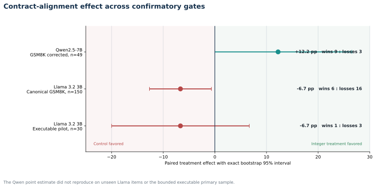
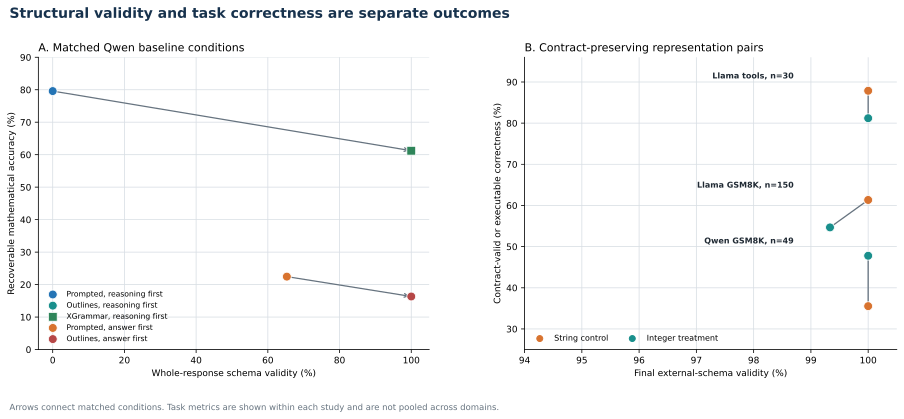
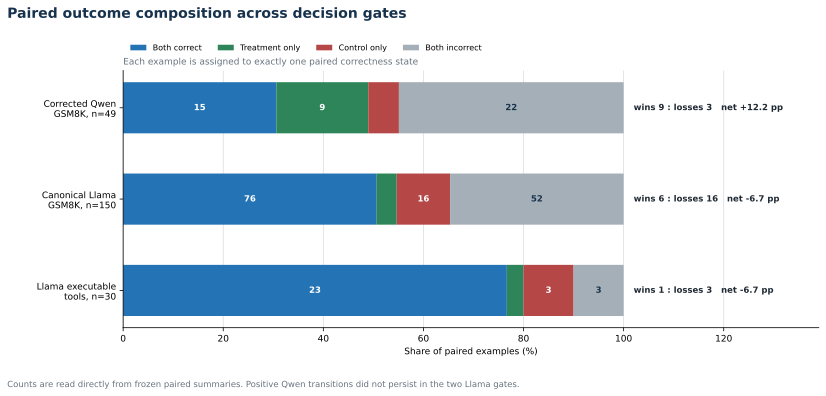
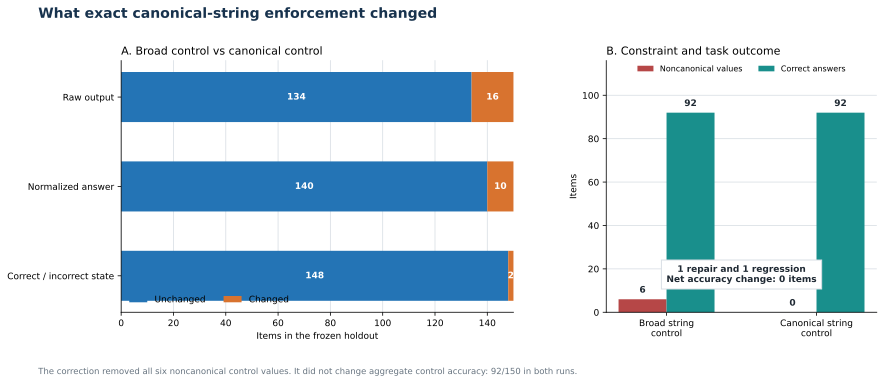
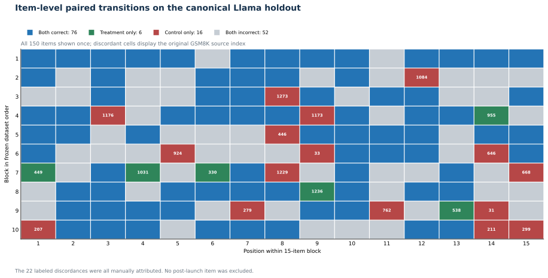
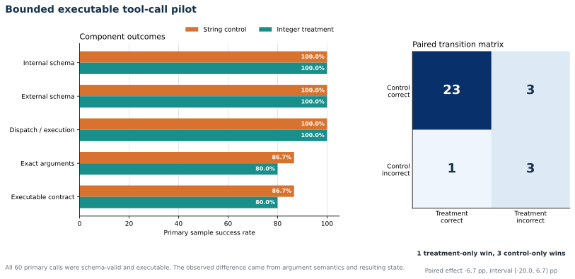

# Results dashboard

  
Model families<strong>Qwen2.5 and Llama 3.2</strong>

  
Paired workloads<strong>GSM8K and BFCL-based tools</strong>

  
Final status<strong>General optimizer claim closed</strong>

This page is the shortest complete route through the final evidence. It separates
the accepted decision gates from the superseded broad-schema intermediate run and
links each visual to the machine-readable record that generated it.

!!! warning "How to interpret these results"

    Effects are paired within each study. They are not pooled across models or
    tasks. A positive Qwen estimate and a negative Llama estimate describe
    workload-specific behavior, not a universal average effect.

## Final accepted effects

| Gate | Control | Treatment | Paired difference | Treatment-only : control-only | Gate outcome |
|---|---:|---:|---:|---:|---|
| Corrected Qwen2.5 7B, GSM8K, n=49 | 36.7% | 49.0% | +12.2 pp, CI [0.0, 26.5] | 9 : 3 | Continue to independent replication |
| Canonical Llama 3.2 3B, GSM8K, n=150 | 61.3% | 54.7% | -6.7 pp, CI [-12.7, -0.7] | 6 : 16 | Close general optimizer claim |
| Llama 3.2 3B, executable tools, n=30 | 86.7% | 80.0% | -6.7 pp, CI [-20.0, 6.7] | 1 : 3 | No practical benefit detected |

<figure class="csl-figure">
  
  <figcaption>Exact paired bootstrap intervals and transition counts from the three accepted decision summaries. The studies are displayed together but not statistically pooled.</figcaption>
</figure>

The Qwen interval touched zero and its exact McNemar test did not reach conventional
significance. It was a credible scoped signal, not proof. The canonical Llama
interval was below zero under the frozen bootstrap procedure. The tool-call interval
crossed zero, so the practical result is reported as no detected benefit rather than
proven harm.

## Valid output is not necessarily a correct output

The baseline showed the distinction directly. Outlines and XGrammar reached 100%
schema compliance under reasoning-first JSON while recoverable mathematical
accuracy was 61.2%. Prompt-only reasoning-first JSON had 0% schema compliance under
the string-valued answer contract while 79.6% of answers were mathematically
recoverable.

<figure class="csl-figure">
  
  <figcaption>Left: matched Qwen baseline conditions. Right: contract-preserving representation pairs. Task metrics are compared only within their own study.</figcaption>
</figure>

The executable pilot sharpened the same point. Every primary call parsed, validated,
dispatched, and executed. Exact argument meaning and post-execution state were still
wrong in four control calls and six treatment calls.

## Where the paired differences came from

Aggregate percentages hide item transitions. Each paired example belongs to exactly
one state:

- both conditions correct;
- treatment only correct, a repair;
- control only correct, a regression;
- both conditions incorrect.

<figure class="csl-figure">
  
  <figcaption>Exact counts from the corrected Qwen, canonical Llama, and executable primary paired summaries.</figcaption>
</figure>

| Gate | Both correct | Treatment only | Control only | Both incorrect | Net paired change |
|---|---:|---:|---:|---:|---:|
| Corrected Qwen | 15 | 9 | 3 | 22 | +6 items |
| Canonical Llama | 76 | 6 | 16 | 52 | -10 items |
| Executable tools | 23 | 1 | 3 | 3 | -2 calls |

The treatment did not merely shift a global confidence score. It changed individual
answers in both directions. The balance of repairs and regressions changed across
the model family and task.

## The schema-equivalence correction

The first Llama control allowed decimals, fractions, comma grouping, and leading
zeros. The compiler transform was proven only for canonical signed integers. That
was a real design mismatch, so the final claim waited for a preregistered canonical
control.

<figure class="csl-figure">
  
  <figcaption>The canonical grammar removed six noncanonical values. It caused one accuracy repair and one regression, so control accuracy stayed at 92/150.</figcaption>
</figure>

No new treatment output was generated. The same immutable integer rows were reused.
The correction changed 16 raw outputs and 10 normalized answers, but only two
correctness states.

## Every canonical discordance

All 150 holdout positions are shown below. Green cells are treatment-only wins, red
cells are control-only wins, blue cells are both correct, and gray cells are both
incorrect. Discordant cells contain the original GSM8K source index.

<figure class="csl-figure">
  
  <figcaption>Complete item map in frozen dataset order. No item was excluded after model outputs were viewed.</figcaption>
</figure>

The complete manual attribution assigned the 22 discordances as follows:

| Engineering attribution | Count |
|---|---:|
| Problem-interpretation change | 10 |
| Reasoning and final-answer inconsistency | 8 |
| Arithmetic regression | 3 |
| Arithmetic correction | 1 |
| Sign or lexical-boundary change | 0 |
| Parser, validator, transducer, truncation, or other | 0 |

These are audited engineering judgments, not automated causal labels. Final-answer
correctness and reasoning consistency remain separate metrics.

## Executable tool-call gate

The practical gate used pinned BFCL V4 `simple_python` cases and deterministic local
wrappers. No external API or real-world side effect was involved.

<figure class="csl-figure">
  
  <figcaption>All 60 primary calls were structurally valid and executable. The observed difference came from exact argument semantics and post-execution state.</figcaption>
</figure>

The treatment did not fail because the transducer broke the contract. It failed on
the semantic question the gate was designed to test: whether the emitted arguments
caused the correct state transition.

## Artifact coverage

| Evidence set | Rows checked | Check type | Outcome |
|---|---:|---|---|
| Corrected Qwen matrix | 200/200 | Dedicated artifact validator | Clean, no warnings |
| Broad second-family matrix | 398/398 | Artifact validator plus score replay | Zero row or summary mismatches |
| Canonical correction | 150/150 new control rows | Dedicated validator with score replay | Zero score mismatches |
| Tool-call pilot | 66/66 | Artifact validator plus score replay | Zero row or summary mismatches |

The general 464-row replay covers the 398-row broad second-family matrix and the
66-row tool-call matrix. It does not include the corrected Qwen or canonical control
rows. Those are protected by their own validators, so coverage is reported
separately rather than combined into one inflated number.

## Machine-readable sources

| Result | Protocol | Validation | Summary | Decision or audit |
|---|---|---|---|---|
| Corrected Qwen | [Protocol](https://github.com/Vaibhav701161/constrained-senstivity-lab/blob/master/experiments/corrected-replication/protocol.md) | [Validation](https://github.com/Vaibhav701161/constrained-senstivity-lab/blob/master/experiments/corrected-replication/results/qwen2.5-7b-corrected/artifact-validation.json) | [Exact summary](https://github.com/Vaibhav701161/constrained-senstivity-lab/blob/master/experiments/corrected-replication/results/qwen2.5-7b-corrected/paired-summary-exact.json) | [Decision](https://github.com/Vaibhav701161/constrained-senstivity-lab/blob/master/experiments/corrected-replication/results/qwen2.5-7b-corrected/decision-report.md) |
| Canonical Llama | [Protocol](https://github.com/Vaibhav701161/constrained-senstivity-lab/blob/master/experiments/canonical-schema-equivalence-correction/protocol.md) | [Validation](https://github.com/Vaibhav701161/constrained-senstivity-lab/blob/master/experiments/canonical-schema-equivalence-correction/artifact-validation.json) | [Paired summary](https://github.com/Vaibhav701161/constrained-senstivity-lab/blob/master/experiments/canonical-schema-equivalence-correction/paired-summary.json) | [22-item audit](https://github.com/Vaibhav701161/constrained-senstivity-lab/blob/master/experiments/canonical-schema-equivalence-correction/failure-attribution.jsonl) |
| Executable tools | [Protocol](https://github.com/Vaibhav701161/constrained-senstivity-lab/blob/master/experiments/tool-call-gate/protocol.md) | [Validation](https://github.com/Vaibhav701161/constrained-senstivity-lab/blob/master/experiments/tool-call-gate/artifact-validation.json) | [Paired summary](https://github.com/Vaibhav701161/constrained-senstivity-lab/blob/master/experiments/tool-call-gate/paired-summary.json) | [Decision](https://github.com/Vaibhav701161/constrained-senstivity-lab/blob/master/experiments/tool-call-gate/decision-report.md) |

## Result boundary

The evidence supports a measurement system, not an automatic schema optimizer. A
safe representation transform may still alter model behavior. The correct default
is therefore:

1. prove or refuse the contract transformation;
2. run a paired workload evaluation;
3. report structural, semantic, and executable outcomes separately;
4. inspect every important discordance;
5. deploy only the workload-scoped result.

[Follow the chronological evidence](../studies/evidence-overview.md){ .csl-button .csl-button--secondary }
[Inspect the architecture](../architecture.md){ .csl-button .csl-button--secondary }
[Replay the artifacts](../reproducibility/artifact-replay.md){ .csl-button .csl-button--primary }
