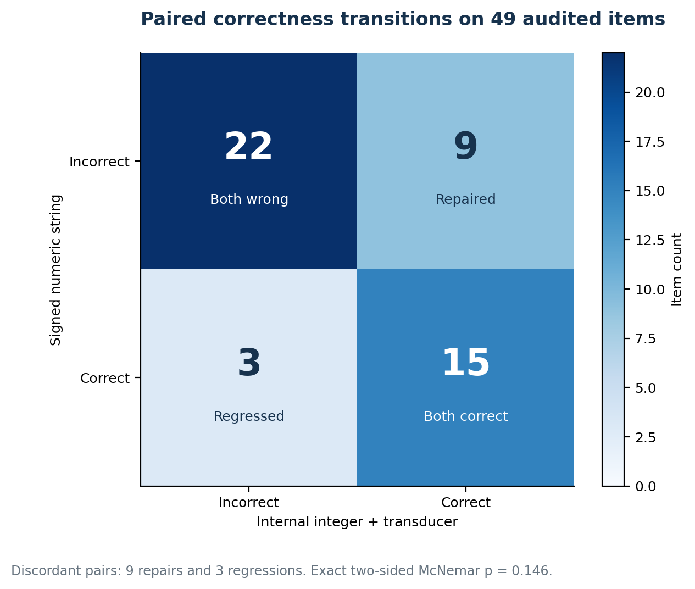

# Corrected Qwen replication

  
Model<strong>Qwen2.5 7B Instruct</strong>

  
Accepted outputs<strong>200 / 200</strong>

  
Paired effect<strong>+12.2 pp</strong>

  
Decision<strong>Scoped continuation</strong>

## Why a correction was necessary

An end-to-end audit found three risks in the historical alignment experiment:

1. the Outlines route could apply the Qwen chat template twice;
2. generated-token counts differed across wrappers;
3. whitespace policies were not compiled to one canonical JSON language.

The runner was corrected before the replication. The new protocol used one chat
template application, backend-independent visible-token counting, canonical compact
JSON, fixed FP32 greedy decoding, and a frozen four-condition matrix.

## Result

| Representation | Contract-valid correct | External validity | Negative answers |
|---|---:|---:|---:|
| Signed numeric string | 18/49 (36.7%) | 49/49 (100.0%) | 2 |
| Integer plus deterministic stringification | 24/49 (49.0%) | 49/49 (100.0%) | 0 |

The paired estimate was **+12.2 percentage points** with an exact deterministic
bootstrap interval of **[0.0, 26.5]**. There were nine treatment-only wins and three
control-only losses. Exact two-sided McNemar `p = 0.145996`.

Outlines and XGrammar were byte-identical for all 200 accepted outputs across both
representations. This ruled out backend implementation divergence for this run, but
did not count as an independent model replication.

## Decision at the time

The point estimate cleared the preregistered five-point continuation threshold. The
interval touched zero and the paired test did not reach conventional significance,
so the result supported a scoped continuation, not a universal claim.

This gate authorized a new model family and unseen holdout. The later Llama results
supersede the general optimizer decision while preserving this as valid Qwen-specific
evidence.

## Primary records

- [Frozen protocol](https://github.com/Vaibhav701161/constrained-senstivity-lab/blob/master/experiments/corrected-replication/protocol.md)
- [Artifact validation](https://github.com/Vaibhav701161/constrained-senstivity-lab/blob/master/experiments/corrected-replication/results/qwen2.5-7b-corrected/artifact-validation.json)
- [Exact paired summary](https://github.com/Vaibhav701161/constrained-senstivity-lab/blob/master/experiments/corrected-replication/results/qwen2.5-7b-corrected/paired-summary-exact.md)
- [Decision report](https://github.com/Vaibhav701161/constrained-senstivity-lab/blob/master/experiments/corrected-replication/results/qwen2.5-7b-corrected/decision-report.md)
