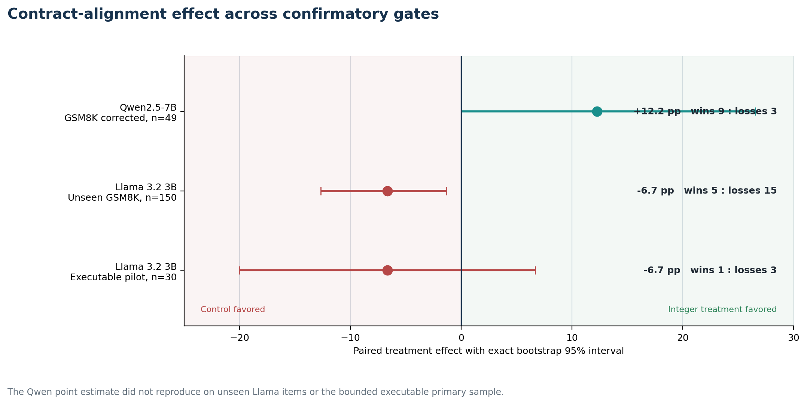

# Evidence overview

The research followed a sequence of increasingly strict decision gates. Each gate
was allowed to change the next question, but not to rewrite completed outcomes.

## Decision ladder

| Gate | Model and workload | Primary comparison | Result | Decision |
|---|---|---|---|---|
| Baseline | Qwen2.5 7B, GSM8K | Prompted JSON vs constrained JSON | Constraints fixed validity and reduced recoverable accuracy | Investigate representation sensitivity |
| Alignment | Qwen2.5 7B, 49 cleaned items | Signed string vs integer plus transducer | +14.3 pp historical signal | Correct runner risks and replicate |
| Corrected replication | Qwen2.5 7B, 49 cleaned items | Signed string vs integer plus transducer | +12.2 pp, interval [0.0, 26.5] | Test another family and unseen items |
| Second family | Llama 3.2 3B, 150 unseen items | Broad numeric string vs integer | -6.7 pp | Correct schema mismatch before final decision |
| Canonical correction | Llama 3.2 3B, same 150 items | Canonical integer string vs integer | -6.7 pp, interval [-12.7, -0.7] | Close optimizer thesis |
| Executable pilot | Llama 3.2 3B, BFCL-based calls | External strings vs internal integers | -6.7 pp, interval [-20.0, 6.7] | Continue as measurement infrastructure |

## What survived every correction

- Structured constraints reliably enforced the tested schemas.
- Model-facing representation and field order changed semantic behavior.
- Integer to canonical-string transduction was deterministic and contract-preserving.
- The direction of the semantic effect did not generalize across model families.
- Exact schema equivalence did not rescue the negative Llama result.
- Paired item analysis exposed changes hidden by aggregate scores.

## What did not survive

The claim that a native integer is a generally better model-facing representation
than a canonical signed numeric string did not replicate. It remains a supported
transformation utility, but using it as a default quality optimization is rejected
by the completed evidence.

## The resulting thesis

Schemas are active model context. A compiler can prove that a representation rewrite
preserves the external contract, but cannot infer that it preserves model quality.
The practical system should therefore combine conservative compilation with paired
contract-sensitivity measurement.

!!! note "Interpretation rule"

    The repository uses the final preregistered decision for architecture choices.
    Earlier positive results remain visible as model-specific historical evidence.

## Navigate the studies

- [Qwen baseline](qwen-baseline.md)
- [Representation alignment](../representation-alignment-results.md)
- [Corrected Qwen replication](corrected-qwen.md)
- [Llama second-family replication](llama-replication.md)
- [Canonical schema correction](canonical-correction.md)
- [Executable tool-call pilot](tool-call-pilot.md)
