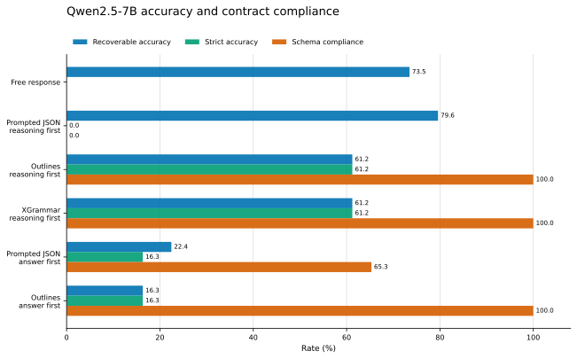
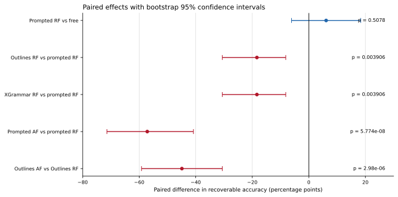
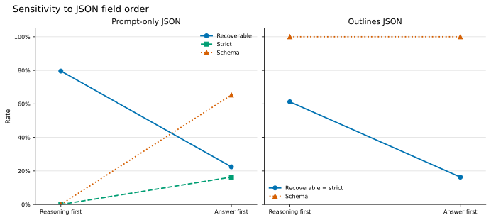
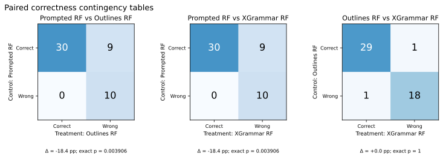

# Qwen baseline

  
Model<strong>Qwen2.5 7B Instruct</strong>

  
Primary matrix<strong>300 generations</strong>

  
Clean analysis<strong>49 paired items</strong>

  
Key finding<strong>Validity and semantics diverged</strong>

## Question

Under matched prompts and greedy decoding, how do prompt-only JSON, Outlines, and
XGrammar differ in schema compliance and mathematical correctness?

## Design

- Model: `Qwen/Qwen2.5-7B-Instruct`
- Dataset: deterministic 50-item GSM8K test subset
- Clean analysis: 49 items after one predeclared contradictory-reference exclusion
- Precision: FP32
- Maximum new tokens: 256
- Prompt formatting: one `tokenizer.apply_chat_template()` application
- Conditions: free response, prompt-only JSON, Outlines JSON, and XGrammar JSON
- Additional causal probe: reasoning-first versus answer-first field order

Generation errors and token-cap hits remained in the denominator. Raw rows and
accepted cloud snapshots are preserved in the repository.

## Main matrix

| Condition | Recoverable accuracy | Strict accuracy | Schema compliance |
|---|---:|---:|---:|
| Free response | 36/49 (73.5%) | Not applicable | Not applicable |
| Prompted JSON, reasoning first | 39/49 (79.6%) | 0/49 (0.0%) | 0.0% |
| Outlines, reasoning first | 30/49 (61.2%) | 30/49 (61.2%) | 100.0% |
| XGrammar, reasoning first | 30/49 (61.2%) | 30/49 (61.2%) | 100.0% |
| Prompted JSON, answer first | 11/49 (22.4%) | 8/49 (16.3%) | 65.3% |
| Outlines, answer first | 8/49 (16.3%) | 8/49 (16.3%) | 100.0% |

<figure class="csl-figure">
  
  <figcaption>Group metrics from the frozen clean 49-item Qwen2.5 7B summary. Recoverable and strict correctness are shown separately.</figcaption>
</figure>

<figure class="csl-figure">
  
  <figcaption>Paired percentage-point effects with frozen bootstrap intervals. Comparisons share item IDs and are not treated as independent samples.</figcaption>
</figure>

## Interpretation

Prompt-only reasoning-first output was semantically strongest, but every answer used
an unquoted JSON number where the schema required a numeric string. Constrained
backends fixed compliance and lost nine paired mathematical answers with no gains.

Field order produced an even larger effect. Requiring the answer before reasoning
reduced recoverable accuracy by 57.1 points under prompting and 44.9 points under
Outlines. Under Outlines, validity remained 100%, isolating generation order from
schema-compliance effects.

<figure class="csl-figure">
  
  <figcaption>Under Outlines, schema compliance remained 100% while recoverable accuracy fell by 44.9 percentage points.</figcaption>
</figure>

<figure class="csl-figure">
  
  <figcaption>Exact paired contingency tables show that constrained and field-order effects came from asymmetric item-level transitions.</figcaption>
</figure>

## Why this mattered

The baseline established that structured-output evaluation cannot stop at parsing
or validation. It motivated the narrower hypothesis that one model-facing lexical
boundary, a signed numeric string, might be avoidably difficult.

## Limitations

- One model family and a small deterministic GSM8K subset
- One predeclared contradictory-reference exclusion in the clean analysis
- Greedy decoding only
- No independent practical execution oracle at this stage
- Historical latency from Kaggle hardware is descriptive

## Primary records

- [Complete research report](../research-report.md)
- [Frozen methodology](../methodology.md)
- [Qwen2.5 7B run ledger](../run-ledgers/qwen2.5-7b.md)
- [Public Kaggle execution record](https://www.kaggle.com/code/vaibhav7011/constrained-decoding-qwen7b-evaluation)
