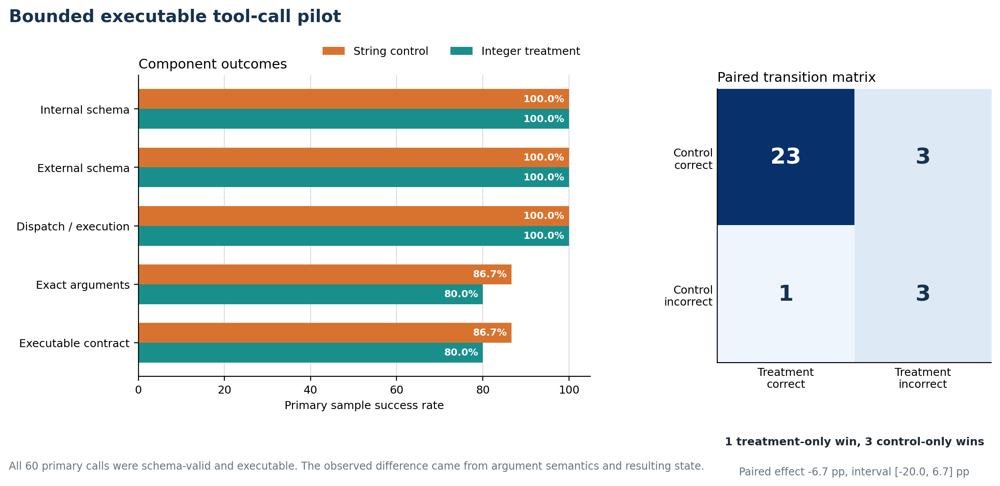

# Executable tool-call pilot

  
Primary set<strong>30 executable calls</strong>

  
Structural validity<strong>100% in both arms</strong>

  
Paired effect<strong>-6.7 pp</strong>

  
Decision<strong>No practical benefit detected</strong>

## Practical question

Does contract alignment improve the probability that a model emits an externally
valid call that also executes with the correct arguments and post-execution state?

## Scope

The pilot used pinned BFCL V4 `simple_python` cases as an evaluation foundation. It
adapted official acceptable arguments to a project-defined external numeric-string
contract and executed deterministic local wrappers with no real-world side effects.

It did not test multi-turn agents, parallel calls, web APIs, memory, or an official
BFCL leaderboard submission.

## Scoring chain

Tool selection
      ↓
Internal schema validity
      ↓
Deterministic inverse transduction
      ↓
External schema validity
      ↓
Execution acceptance
      ↓
Exact post-execution state

A row counted as successful only when the complete chain succeeded. No heuristic
repair was permitted.

## Primary result

| Metric | String control | Integer treatment |
|---|---:|---:|
| Executable-contract success | 26/30 (86.7%) | 24/30 (80.0%) |
| Internal-schema validity | 30/30 (100.0%) | 30/30 (100.0%) |
| External validity after reconstruction | 30/30 (100.0%) | 30/30 (100.0%) |
| Exact argument semantics | 26/30 (86.7%) | 24/30 (80.0%) |
| Correct post-execution state | 26/30 (86.7%) | 24/30 (80.0%) |

The paired effect was **-6.7 percentage points**, interval **[-20.0, 6.7]**, with
one treatment-only win and three control-only losses. Exact McNemar `p = 0.625`.

All structural and dispatch checks succeeded. The observed differences came from
argument semantics, not transduction or validation. The separate three-case sign
stress set was too small and did not show a direct sign repair.

## Decision

The practical pilot did not rescue the optimizer hypothesis. It supports the same
product pivot as the cross-family study: provide a harness that detects schema-driven
regressions before deployment rather than promising an intrinsically better schema.

## Primary records

- [Foundation and provenance](https://github.com/Vaibhav701161/constrained-senstivity-lab/blob/master/experiments/tool-call-gate/FOUNDATION.md)
- [Frozen protocol](https://github.com/Vaibhav701161/constrained-senstivity-lab/blob/master/experiments/tool-call-gate/protocol.md)
- [Artifact validation](https://github.com/Vaibhav701161/constrained-senstivity-lab/blob/master/experiments/tool-call-gate/artifact-validation.json)
- [Paired summary](https://github.com/Vaibhav701161/constrained-senstivity-lab/blob/master/experiments/tool-call-gate/paired-summary.md)
- [Decision report](https://github.com/Vaibhav701161/constrained-senstivity-lab/blob/master/experiments/tool-call-gate/decision-report.md)
