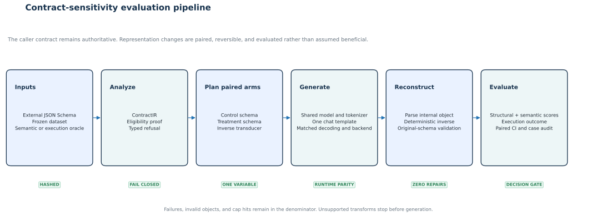

# System overview

Constrained Sensitivity Lab combines a narrow contract-analysis prototype with a
paired evaluation harness. The system proves what it can about representation
equivalence, refuses unsupported transforms, and measures model behavior instead of
assuming that a safe rewrite improves quality.

<figure class="csl-figure">
  
  <figcaption>The external contract remains authoritative. Unsupported transforms stop before generation, and failed rows remain in the analysis denominator.</figcaption>
</figure>

## Two independent gates

| Gate | Question | Evidence |
|---|---|---|
| Contract gate | Is the rewrite invertible and externally valid within its declared domain? | IR analysis, typed refusal, property tests, final validation |
| Quality gate | Does the model perform better, worse, or differently under the rewrite? | Frozen paired generations, semantic or execution oracle, uncertainty, discordance audit |

A transform can pass the contract gate and fail the quality gate. That is exactly
what the canonical Llama and executable studies observed.

## Python namespace

New code may import the branded `constrained_sensitivity_lab` facade. The
`project_a` implementation namespace is retained for compatibility with frozen
source manifests and archived execution packages. Removing or rewriting those
historical paths would weaken artifact provenance.

## Read next

  

    Architecture
    <h3>Information boundaries</h3>
    
Trace ContractIR, plans, runtime parity, transduction, and fail-closed behavior.

    <a href="../architecture/">Read architecture</a>
  

  

    Support policy
    <h3>Supported contracts</h3>
    
See the exact supported, prototype, experimental, and refused schema features.

    <a href="../supported-contracts/">Open the matrix</a>
  

  

    Method
    <h3>Paired evaluation</h3>
    
Understand frozen comparison surfaces, denominators, statistics, and audits.

    <a href="../methods/">Read methodology</a>
  

